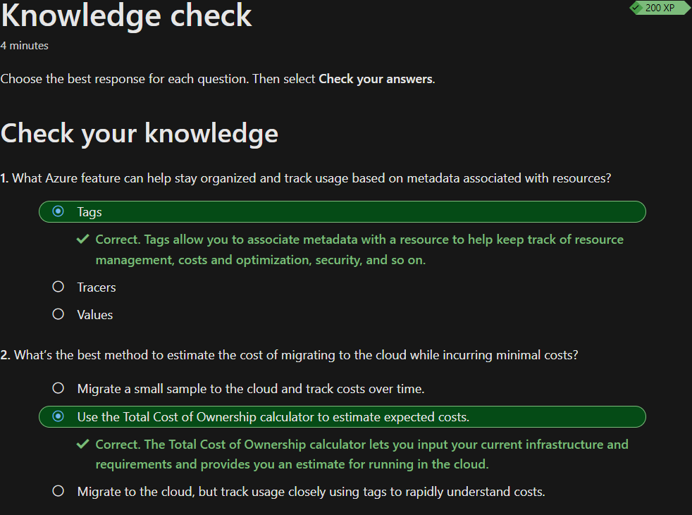

## Kostenverwaltung in Azure

Das Kostenmodell von Azure wurde bereits im Thema [Cloud Computings](./Beschreiben_des_Cloud_Computings.md#verbrauchsbasierten-modells-kostenmodell) behandelt und kurz zusammengefasst. Das Thema wird in diesem Kapitel aber noch vertieft, weshalb ich neu gelerntes zusammenfassen werde.

In Azure werden Kosten durch verschiedene Faktoren beeinflusst. Das könnten folgende sein:

- Ressourcentyp - welche Ressource gewählt wird
- Nutzung - Pay as you go
- Wartung - Eigenverantwortung der Verwaltung von Ressourcen
- Gebiet - Regions
- Abonnementtyp - Subscribtions
- Azure Marketplace - Kosten von Drittanbietern

## Pricing and Total Cost of Ownership calculators

Damit man eine Übersicht der potenziellen Ausgaben hat, bietet Azure zwei unterschiedliche Rechner. Der *pricing calculator* und der *total cost of ownership* (TCO)

### Pricing calculator

Der *pricing calculator* ist für die Berechnung von Ressourcen in Azure. Mit diesem kann man selbst Szenarien erstellen, welche die Ressourcen eines Kunden oder die internen Ressourcen simulieren. Somit können Kosten bereits vorkalkuliert werden, bevor diese entstehen. 

Wichtig ist zu erwähnen, dass dies nur Schätzungen sind.

### Total cost of ownership (TCO) calculator

Mit dem *TCO calculator* kann die aktuelle Infrastruktur inkl. Speicher, ausgehender Netzwerkverkehr, Server etc. mit einer Server-Infrastruktur in der Azure-Cloud verglichen werden. Der *TCO* übernimmt die eingetragene Werte und simuliert mit diesen eine Umgebung in der Cloud.

Wichtig ist zu erwähnen, dass dies nur Schätzungen sind.

## Eigene Kostenschätzung

Ich habe eine eigene Kostenschätzung für die nötigen Ressourcen für eine Webanwendung erstellt:

| Microsoft Azure Estimate |                     |             |                   |                                                                                                                                                                                                                                                                                               |                        |                        |
|--------------------------|---------------------|-------------|-------------------|-----------------------------------------------------------------------------------------------------------------------------------------------------------------------------------------------------------------------------------------------------------------------------------------------|------------------------|------------------------|
| Ihre Schätzung           |                     |             |                   |                                                                                                                                                                                                                                                                                               |                        |                        |
| Service category         | Service type        | Custom name | Region            | Description                                                                                                                                                                                                                                                                                   | Estimated monthly cost | Estimated upfront cost |
| Compute                  | Virtual Machines    |             | Switzerland North | 2 D2 v3 (2 vCPUs, 8 GB RAM) × 730 Stunden (Nutzungsbasierte Bezahlung), Windows (Enthaltene Lizenz), Nur Betriebssystem; 0 verwaltete Datenträger – S4; Regionsübergreifender Übertragungstyp, Ausgehende Datenübertragung (5 GB) von Schweiz, Norden zu Ostasien                             | CHF296.67              | CHF0.00                |
| Datenbanken              | Azure SQL Database  |             | Switzerland North | Einzeldatenbank, Virtueller Kern, Allgemein, Bereitgestellt, Standard-Serie (Gen5), Lokal redundant, 1 – 8 virtuelle(r) Kern/e Datenbank(en) x 730 Stunden, 32 GB Speicher, RA-GRS Redundanz für Sicherungsspeicher, 0 GB Point-in-Time-Wiederherstellung, 0 x 5 GB langfristige Aufbewahrung | CHF1’511.54            | CHF0.00                |
| Netzwerk                 | Application Gateway |             | Switzerland North | Basic Dienstebene, Moderat Instanzgröße: 2 Gatewaystunde(n) × 730 Stunden, 1 TB verarbeitete Dateneinheit(en), 5 GB Zoneneinheit(en)                                                                                                                                                          | CHF114.22              | CHF0.00                |
| Support                  |                     |             | Support           | 0                                                                                                                                                                                                                                                                                             | CHF0.00                |                        |
|                          |                     |             | Licensing Program | Microsoft Customer Agreement (MCA)                                                                                                                                                                                                                                                            |                        |                        |
|                          |                     |             | Billing Account   |                                                                                                                                                                                                                                                                                               |                        |                        |
|                          |                     |             | Billing Profile   |                                                                                                                                                                                                                                                                                               |                        |                        |
|                          |                     |             | Total             |                                                                                                                                                                                                                                                                                               | CHF1’922.43            | CHF0.00                |

## Azure Cost Management tool

Damit man die Kosten im laufenden Betrieb in der Cloud im Griff hat, biete Azure verschiedene *cost management tool's*. 

### Cost Management

Im *cost management* Bereich können nicht nur aktuelle Kostenanalysen verfolgt werden, es werden auch Möglichkeiten wie: *Cost alerts*, *Budget alerts*, *Credit alerts*, *department spending quota alerts* und *Budets* angeboten.

### Cost alerts

In den *Cost alerts* kann man zentral die unterschiedlichen Warnungstypen überprüfen. Dabei können drei Warnungstypen vorkommen.

#### Budget alerts

Hier kann man eine Benachrichtigung einschalten, welche bei einer Überschreitung eines eingerichteten Budgets ausgelöst wird.

#### Credit alerts

Vom *Credit alert* aus wird eine Benachrichtigung gesendet, wenn 90% von 100% des Azure-Guthabens aufgebraucht wurde. Diese automatische Benachrichtigung betrifft nur Organisationen mit einem *Enterprise Agreement* (EA).

#### Department spending quota alerts

Hier können Warnmeldungen für Abteilungen mittels Ausgabenkontingenten eingerichtet werden. Wenn ein Schwellenwert erreicht wurde, wird an die Besitzer der Abteilung eine Email gesendet.

### Budgets

Mit dem Budget kann man Ausgabelimite für Azure festlegen. Diese können basierend auf *Subscribtions*, *recource groups* oder anderen Kriterien festgelegt werden. Spannend ist hier, dass man erweitert noch Budgetbedingungen festlegen kann, welche Automatisierungen auslösen. So können z.B. Ressourcen beim Erreichen der Ausgabelimite angehalten werden.

## Wissenscheck

Zum Schluss habe ich den Wissenscheck erfolgreich absolviert und kann nun mit dem nächsten Thema starten.

## Kurze Reflexion

Das Kostenmodell von Azure habe sehr schnell verstanden. Das Ausprobieren des *pricing calculators* habe ich sehr spannend gefunden. Ich finde die *Cost management tools* von Azure sehr nützlich und habe diese persönlich unterschätzt.

## Inhaltsverzeichnis

[2. Hauptteil](./README.md)

[Titelseite (Hauptinhaltsverzeichnis)](../README.md)
