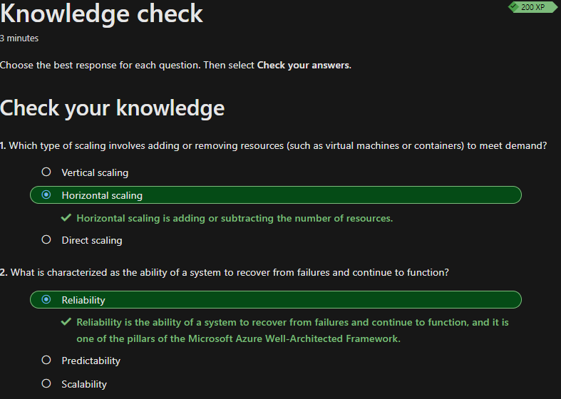

## Vorteile der Verwendung von Clouddiensten

Das Thema *Vorteile der Verwendung von Clouddiensten* enthält einige Punkte, welche ich noch nicht kannte, weshalb ich die gelernten Themen zusammengefasst habe

Ich werde die neu erlernten Themen zusammenfassen und am Ende eine kurze Reflexion über das gelernte schreiben.

### Hochverfügbarkeit und Skalierbarkeit in der Cloud

#### Hochverfügbarkeit

Ich kannte den Begriff *Hochverfügbarkeit* bereits. Ich wusste jedoch nicht, dass Azure ihre *Hochverfügbarkeit* mittels SLA anbietet. Hier gilt zu wissen, dass eine 100 % Verfügbarkeit sehr schwierig zu erreichen ist und enorm viel Geld kostet. Diese *Hochverfügbarkeit* wird auch Uptime genannt. In folgendem Beispiel sieht man, wie sich diese Uptime prozentual auf eine Woche oder auf einen Monat auswirken kann.

Bei einem SLA mit einer *99% Uptime* darf eine Azure Anwendung oder ein Azure Dienst in der *Woche 1.68 Stunden* oder in einem *Monat 7.2 Stunden* down sein.
Bei einem SLA mit einer *99.9% Uptime* darf eine Azure Anwendung oder ein Azure Dienst in der *Woche 10 Minuten* oder in einem *Monat 43.2 Minuten* down sein.

#### Skalierbarkeit

Die Skalierbarkeit bietet die Möglichkeit, Ressourcen, wenn nötig, zusätzlich zu mieten und somit Systemauslastungen entgegenzuwirken. So könnte z.B. ein Onlinehändler wie Ticketcorner die Performance ihrer Webseite hochskalieren, wenn damit gerechnet werden kann, dass ein Ansturm an Tickets bevorsteht. Mit der Skalierbarkeit können auch Kosten gespart werden. Bei sinkender Nachfragen können Ressourcen wieder reduziert werden.

Bei der Skalierung gibt es bei Azure zwei Möglichkeiten. Die vertikale und horizontale Skalierung.

#### Vertikale Skalierung

Bei der vertikalen Skalierung werden der virtuellen Maschine RAM und/oder CPU hinzugefügt. So wird der Maschine generell mehr Ressourcen zur Verfügung gestellt. Diese kann wieder entzogen werden, wenn diese nicht mehr benötigt wird.

#### Horizontale Skalierung

Bei der horizontalen Skalierung werden weitere Container oder virtuelle Maschinen bereitgestellt, um z.B. unerwarteten steigenden Anfragen entgegenzuwirken. Diese kann manuell oder automatisch gesteuert werden.

#### Zuverlässigkeit

Die Zuverlässigkeit wird seitens Microsoft via Georedundanz und der verschiedenen availability zone gewährleistet. 

#### Vorhersagbarkeit

Ein grosser Vorteil der Cloud ist die Vorhersagbarkeit. Mit dieser kann man ermitteln, wie viel Leistung gebraucht oder Kosten verursacht werden. Auf die Vorteile der Leistung in der Cloud werde ich nicht weiter eingehen, da dieses Thema bereits erwähnt wurden.

#### Kosten

Azure bietet verschieden Möglichkeiten, die Kosten im Überblick zu haben. Diese können in Echtzeit nachverfolgt werden. Azure bietet zudem verschiedene Tools, welche Kostenanalysen durchführen. Mithilfe dieser Analysen können die Ausgaben noch besser angepasst werden.

### Sicherheit und Governance in der Cloud

Azure bietet, egal welches Cloudmodell man im Einsatz hat, die dafür unterstützte Cloudfeatures Governance und Compliance. Mithilfe von Vorlagen wird sichergestellt, dass bereitgestellte Ressourcen unternehmensinterne Standards und gesetzlichen Vorschriften entsprechen.
Die Sicherheit wird, wie bereits [hier](./Beschreiben_des_Cloud_Computings.md#Shared-Responsibility-Modells), mit dem Shared-Responsibility-Modells definiert.

Ich habe mich mit der Dokumentation von Microsoft nicht zufriedengestellt, weshalb ich eine Antwort von ChatGPT erhalten wollte. ChatGPT antwortete mir auf die Frage "Erkläre mir Sicherheit und Governance in der Cloud von Azure" mit folgendem Text:

*Sicherheit und Governance sind zwei wichtige Aspekte beim Einsatz von Cloud-Diensten wie Microsoft Azure. Hier ist eine Erklärung, was diese Begriffe bedeuten und wie sie in Azure umgesetzt werden:*

1.  *Sicherheit in der Cloud von Azure: Die Sicherheit in der Azure-Cloud umfasst eine Vielzahl von Maßnahmen zum Schutz der Systeme, Daten und Anwendungen vor unbefugtem Zugriff, Datenverlust, Bedrohungen und anderen Sicherheitsrisiken. Azure stellt eine Reihe von integrierten Sicherheitsfunktionen und -diensten zur Verfügung, die Folgendes umfassen:*
    
    *a. Identitäts- und Zugriffsverwaltung: Azure Active Directory (Azure AD) ermöglicht die zentrale Verwaltung von Benutzeridentitäten und den Zugriff auf Azure-Ressourcen. Es bietet Funktionen wie Multi-Faktor-Authentifizierung und Single Sign-On, um die Sicherheit der Identitätsverwaltung zu erhöhen.*
    
    *b. Netzwerksicherheit: Azure Virtual Network (VNet) ermöglicht die Erstellung von isolierten Netzwerken und die Segmentierung von Ressourcen. Netzwerksicherheitsgruppen (Network Security Groups, NSGs) ermöglichen die Definition von Firewall-Regeln zur Steuerung des Datenverkehrs zwischen den Ressourcen.*
    
    *c. Datenverschlüsselung: Azure bietet Möglichkeiten zur Verschlüsselung von Daten sowohl im Ruhezustand als auch während der Übertragung. Azure Storage bietet beispielsweise automatische Verschlüsselung für gespeicherte Daten.*
    
    *d. Bedrohungserkennung und -abwehr: Azure Security Center bietet eine umfassende Sicherheitsüberwachung und Bedrohungserkennung für Azure-Ressourcen. Es erkennt Angriffe, verdächtiges Verhalten und Schwachstellen und bietet Empfehlungen zur Behebung von Sicherheitslücken.*
    
2.  *Governance in der Cloud von Azure: Governance bezieht sich auf die Definition und Durchsetzung von Richtlinien, Best Practices und Verfahren zur effektiven Verwaltung der Cloud-Ressourcen. Azure bietet eine Reihe von Funktionen und Diensten, um die Governance zu unterstützen:*
    
    *a. Azure Policy: Mit Azure Policy können Richtlinien definiert und erzwungen werden, um sicherzustellen, dass Azure-Ressourcen im Einklang mit Unternehmensstandards und Compliance-Anforderungen bereitgestellt werden. Richtlinien können beispielsweise Regeln zur Ressourcenkennzeichnung, zur Überprüfung der Konfiguration oder zur Einhaltung bestimmter Sicherheitsstandards festlegen.*
    
    *b. Kostenmanagement: Azure bietet Funktionen zur Überwachung und Verwaltung von Kosten, um sicherzustellen, dass Ressourcen effizient genutzt und Budgets eingehalten werden. Azure Cost Management and Billing bietet Funktionen zur Kostenverfolgung, Budgetierung und Abrechnung.*
    
    *c. Rollenbasierte Zugriffssteuerung (Role-Based Access Control, RBAC): Azure RBAC ermöglicht die Feinabstimmung von Zugriffsberechtigungen für Azure-Ressourcen. Administratoren können benutzerdefinierte Rollen erstellen und den Zugriff auf Basis von Aufgaben und Verantwortlichkeiten zuweisen.*
    
    *d. Überwachung und Compliance: Azure bietet umfangreiche Überwachungs- und Compliance-Funktionen, darunter Protokollierung, Überwachung von Sicherheitsereignissen, Konformitätszertifizierungen (wie ISO 27001, GDPR usw.) und Unterstützung für Audit- und Compliance-Anforderungen.*
    

*Diese Sicherheits- und Governance-Funktionen in Azure ermöglichen es Unternehmen, ihre Cloud-Ressourcen sicher und effektiv zu verwalten, Compliance-Anforderungen zu erfüllen und die Daten und Systeme vor Bedrohungen zu schützen. Es ist jedoch wichtig zu beachten, dass die effektive Nutzung dieser Funktionen auch eine angemessene Konfiguration und Überwachung seitens der Unternehmen erfordert.*
[Quelle ChatGPT](https://chat.openai.com/)

Ich musste weiter recherchieren, weil ich den Begriff *Governance* immer noch nicht so richtig verstanden habe. Ich habe ChatGPT eine gezielte Frage bezüglich *Governance* gestellt. Und verstehe nun, dass Governance in der Azure Cloud für die Verwaltung der Ressourcen, Dienste und Umgebungen zuständig ist. Es geht darum, klare Regeln und Kontrollen festzulegen, um sicherzustellen, dass Azure-Ressourcen im Einklang mit den Unternehmensstandards, Best Practices, Compliance-Anforderungen und Sicherheitsrichtlinien verwendet werden.

### Beschreiben der Vorteile der Verwaltbarkeit in der Cloud

Es gibt 2 Verwaltungsarten für das Cloud-Computing. *Verwaltung der Cloud* und *Verwaltung in der Cloud*, die 2 Begriffe werden nachstehend kurz beschreiben.

#### Verwaltung der Cloud

*Verwaltung der Cloud* bedeutet grundsätzlich, dass man die Ressourcen, welche man in der Cloud zur Verfügung hat, verwalten kann. Hier sind die Themen, welche in diesem Kapitel beschrieben wurden gemeint:
- Skalierung der Ressourcen ([Hochverfügbarkeit und Skalierbarkeit in der Cloud](Beschreiben_der_Vorteile_der_Verwendung_von_Clouddiensten.md#Skalierbarkeit))
- Automatisiertes bereitstellen von Ressourcen basierend auf vorkonfigurierte Vorlagen ([Governance und Compliance](Beschreiben_der_Vorteile_der_Verwendung_von_Clouddiensten.md#sicherheit-und-governance-in-der-cloud))
- Überwachen der Integrität von Ressourcen ([Governance und Compliance](Beschreiben_der_Vorteile_der_Verwendung_von_Clouddiensten.md#Sicherheit-und-Governance-in-der-Cloud))
- Echtzeitinformation durch konfigurierte Warnungen ([Kosten](Beschreiben_der_Vorteile_der_Verwendung_von_Clouddiensten.md#Kosten))

#### Verwaltung in der Cloud

*Verwaltung in der Cloud* ist die Art, wie man auf die Clouddienste und Ressourcen zugreifen kann. Folgende Möglichkeiten gibt es:
- Webportal
- Befehlszeilenschnittstelle
- API's
- Powershell

## Wissenscheck

Zum Schluss habe ich den Wissenscheck erfolgreich absolviert und kann nun mit dem nächsten Thema starten.

## Kurze Reflexion

Ich hatte in diesem Learning-Path Modul etwas mühe den Begriff Governance zu verstehen. Dadurch, dass ich mich mir die Informationen nicht nur im Learning-Path geholt habe, sondern auch anderer Informationsquellen berücksichtigt habe, verstehe ich jetzt den Begriff. Ausserdem habe ich öfter die Vertikale - und Horizontale Skalierung. 

Dazu habe ich mir folgende Eselsbrücke angeeignet: 
Vertikale Skalierung braucht es bei einem Leistungspeak (CPU und RAM Auslastung gehen nach oben - vertikal)
Horizontale Skalierung braucht es bei einer unerwarteten Auslastung und es müssen mehr virtuelle Maschinen oder Container "nebeneinander" bereitgestellt werden (mehr Ressourcen nebeneinander - horizontal).

## Inhaltsverzeichnis

[2. Hauptteil](./README.md)

[Titelseite (Hauptinhaltsverzeichnis)](../README.md)
