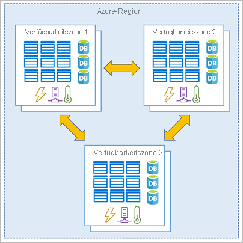
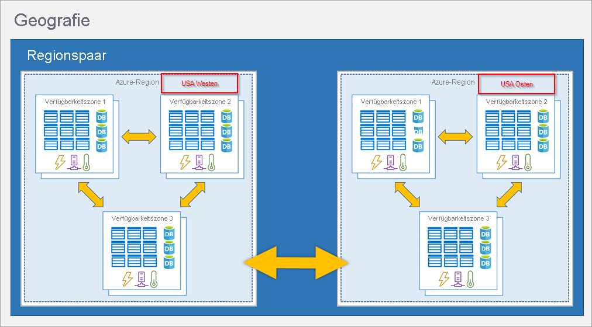
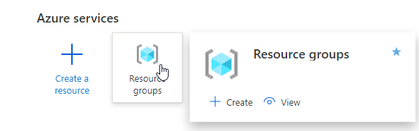
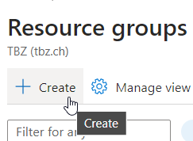
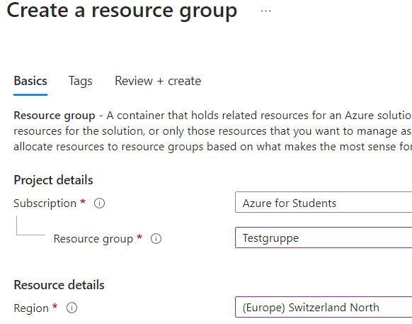
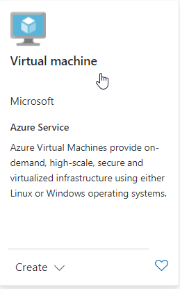
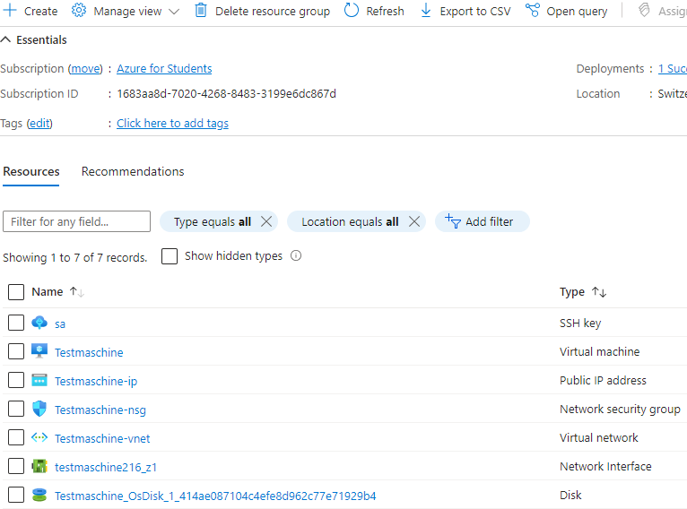
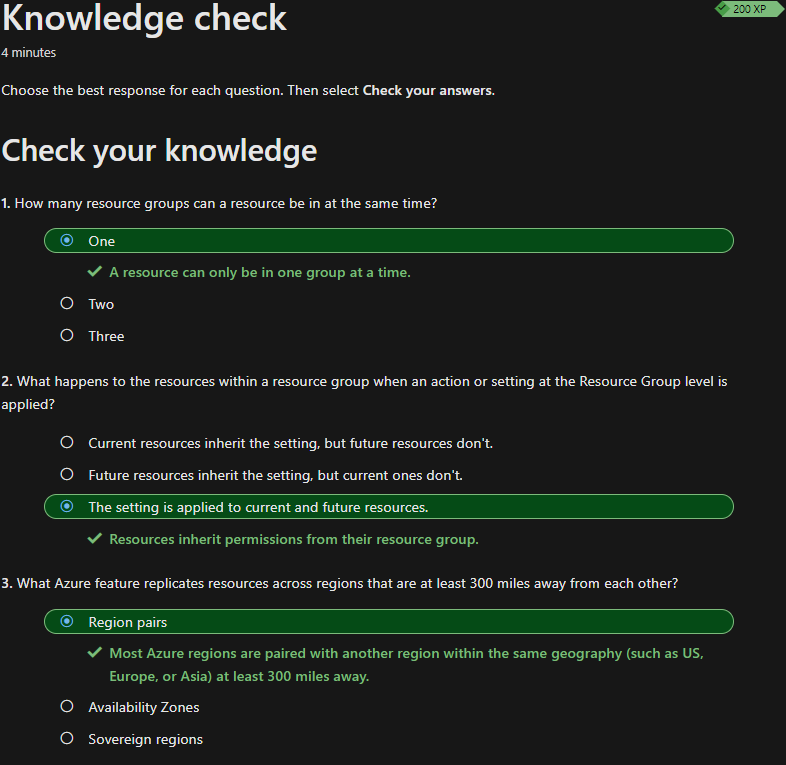

## Beschreiben der wichtigsten Architekturkomponenten von Azure

Was Microsoft Azure ist, habe ich bereits [hier](../1_Einleitung/Microsoft_Azure.md) in der Einleitung beschrieben. Das ganze Thema *Architekturkomponenten von Azure* kannte ich noch nicht, weshalb ich die gelernten Themen zusammengefasst habe.

Die Fachbegriffe habe ich jetzt Englisch dokumentiert, damit ich es an der Zertifizierung einfacher habe.

Am Schluss der Dokumentation findet man noch ein Praxisbeispiel zur Erstellung einer Ressource in Azure
 
### Azure physical infrastructure

Die physische Infrastruktur von Azure ist konzeptionell vergleichbar mit einem Unternehmensrechenzentrum. Die Ressourcen sind in Racks angeordnet und verfügen über dedizierte Energie, Kühl - und Netzwerkinfrastrukturen. Azure hat Rechenzentren auf der ganzen Welt. Auf diese einzelnen Rechenzentren haben wir aber keinen direkten Zugriff. Die Rechenzentren werden in *Azure Regions oder Azure Availability Zones* gruppiert. Diese helfen dem Konsumenten, die Resilienz und Zuverlässigkeit für kritische Workload's zu erreichen.

#### Regions

In einer *Region*, welche ein geografischer Bereich auf der Erde ist, befindet sich mindestens ein, möglicherweise jedoch mehrere, Rechenzentren. Diese sind nicht weit voneinander entfernt über ein Netzwerk mit geringer Latenz miteinander verbunden. Ressourcen werden von Azure innerhalb jeder Region intelligent zugewiesen und kontrolliert, somit wird gewährleistet, dass die Workload's gleichmässig verteilt werden.

#### Availability Zones

*Availability Zones* sind in einer *Region* physisch getrennte Rechenzentren. Jede *Availability Zones* enthält meistens 1-3 Rechenzentren, mindestens jedoch ein Rechenzentrum, die über eine eigene Stromversorgung, Kühlung und Netzwerkbetriebe verfügen. Diese sind als Isolationsgrenzen eingerichtet. Falls eine *Availability Zones* aussteigt, sind die anderen immer noch verfügbar. *Availability Zones* sind mit privaten Glasfasernetzwerke miteinander verbunden. Momentan werden *Availability Zones* nicht in allen *Regions* unterstützt.

Zur Veranschaulichung folgendes Bild:

[Quelle](../4_Anhang/Quellenangabe#Availability-Zones)

#### Region Pairs

Die meisten *Regions* werden mit anderen *Regions* zu einem *Region Pair* zusammengeführt. Dafür müssen die *Regions* mindestens 300km voneinander entfernt und in der gleichen Geografie (z.B. USA, Europa, Asien) liegen. Die *Region Pairs* können gewissermassen als Georedundanz genutzt werden. Im Falle einer Naturkatastrophe in einer *Region* können die replizierten Ressourcen in der anderen *Region* des *Region Pairs* als Failover automatisch weiter betrieben werden. Wichtig ist hierbei aber zu beachten, dass Azure nicht automatisch alle Azure-Dienste oder Daten repliziert. Es liegt im Interesse des Konsumenten, seine Daten und Dienste über eine regionsübergreifende replizieren *Region* zu replizieren.

Folgendes Beispielbild zeigt eine solch mögliches *Region Pair*:

[Quelle](../4_Anhang/Quellenangabe#Region-Pairs)

#### Sovereign Region

Azure bietet noch sogenannte *Sovereign Region* oder unabhängige Regionen, welche im Gegensatz zu herkömmlichen *Regions* von der Hauptinstanz von Azure isoliert sind. Diese werden meistens von Behörden oder ähnlichem verwendet, welches aus Gesetzes gründen isoliert werden müssen.

### Azure management infrastructure

*Azure management infrastructure*, umfasst wie der Name schon sagt, alle Azure-Ressourcen sowie Ressourcengruppen, Abonnements und Konten.

#### Azure ressources and Resource groups

Eine Ressource ist in Azure ein Grundbaustein. Alles was bereitgestellt wird, ist eine Ressource, wie z.B. VM's, Datenbanken, Services, virtuelle Netzwerke usw.

Um eine Ressource bereitstellen zu können, müssen diese erst einer Ressourcengruppe zugewiesen werden. Eine Ressourcengruppe kann mehrere Ressourcen enthalten. Eine Ressource kann aber nur einmal in einer Ressourcengruppe vorkommen. Wichtig ist zu beachten, dass alle Anpassungen auf die Ressourcengruppe auch Einfluss auf die darin gehörige Ressource hat. Wenn man z.B die Ressourcengruppe löscht, löscht man auch automatisch alle darin enthaltenen Ressourcen. Das gleiche Prinzip gilt für Berechtigungen.

#### Subscriptions

Azure *Subscribtions* ist eine Einheit für die Verwaltung, Skalierung und Abrechnung. Damit man Azure benutzen kann, ist ein Abonnement (*Subscription*) erforderlich. Ein Abonnement bietet authentifizierten und autorisierten Zugriff auf Azure-Produkte und -Dienste. Ein Konto kann mehrere *Subscriptions* umfassen.
Über Azure *Subscribtions* können Grenzen für Azure Produlte, Dienst und Ressourcen definiert werden. Azure bietet zwei Arten von Abonnementgrenzen:

- Billing boundary:
	Dieser *Subscribtiontyp* biete die Möglichkeit, verschieden Rechnungen für verschiedene Accounts zu generieren, welche Azure benutzen. Somit können z.B. die Kosten von verschiedenen Abteilungen auseinander gehalten werden

- Access control boundary:
	Hier werden access-management policies auf dem *Subscriptionlevel* gesteuert. Somit erhalten verschiedene Abteilungen verschieden Zugriffsberechtigungen auf Azure.

#### Management groups

Die Management groups verwalten *Subscriptiontyp* übergreifend *Subscriptions*. Alle *Subscriptions* erhalten innerhalb einer *management group* erben automatisch die Bedingungen, die auf die *management group* angewandt wurde. Genau so erben Ressourcengruppen von *Subscriptions* und Ressources von Ressourcengruppen.

### Praxisbeispiel Ressourcenerstellung

Alles in allem ist es ziemlich einfach, eine Ressource zu erstellen.

Als Erstes meldet man sich https://portal.azure.com an. Dann wählt man *Resource groups*

Dann erstellt man eine neue *Recource group*

ich habe meine Ressourcengruppe wie folgt konfiguriert, wobei die Subscription unsere Schul-Subscription ist:

In dieser Ressourcengruppe habe ich dann einen neuen Service erstellt. Ich habe mich für eine virtuelle Maschine entschieden.

Ich habe für den Test alle Einstellungen auf Default gelassen und der Maschine einen Namen gegeben. Azure hat nun die nötigen Ressourcen für meinen Service automatisch hinzugefügt.

### Wissenscheck

Zum Schluss habe ich den Wissenscheck erfolgreich absolviert und kann nun mit dem nächsten Thema starten.

### Kurze Reflexion

Ich hatte, etwas mühe die Subscriptions zu verstehen und habe dort etwas länger gebraucht. Ich musste die Dokumentation des Learning-Paths mehrmals durchlesen, um mir ein Bild machen zu können. Grundsätzlich fand ich das ganze Thema *Azure management infrastructure* nicht ganz einfach.

## Inhaltsverzeichnis

[2. Hauptteil](./README.md)

[Titelseite (Hauptinhaltsverzeichnis)](../README.md)
