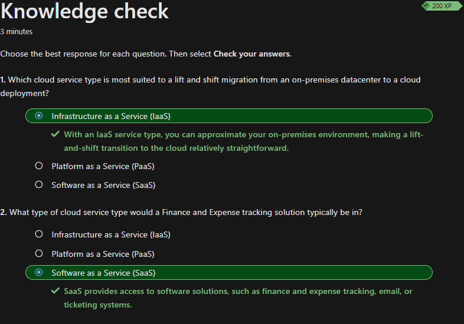

## Beschreiben des Cloud-Computings

Da ich bereits einige Berührungspunkte während der Arbeit mit der Cloud hatte, ist mir dies kein Fremdwort. Hauptsächlich habe ich mit Microsoft Intune und Office 365 zu tun. Teilweise habe ich auch Einblicke in das Azure Active Directory. Einiges was in diesem Modul beschrieben wird, kannte ich bereits, weshalb dies eine Repetition für mich ist. Nichtsdestotrotz möchte ich einige Begriffe vertieft analysieren und dokumentieren. Am Ende des Kapitels werde ich eine kurze Reflexion über das gelernte schreiben.

### Shared-Responsibility-Modells

Beim Shared Responsibility Model handelt es sich um die Verantwortungsaufteilung zwischen dem Cloudanbieter und des Konsumenten. In den verschiedenen Services wird genauer unterteilt, wer wie viel Verantwortung hat.

Beim *Infrastructur as a Service (IaaS)* Model liegt die Verantwortung für das Warten der Hardware, Netzwerks, Energie, Konnektivität und Datacenter beim Provider. Alles darüberliegende liegt im Verantwortungsbereichs des Konsumenten.

Beim *Platform as a Service (PaaS)* Model werden je nach bezogenen Service die Verantwortung unter Provider und Konsument aufgeteilt, so ist z.B. der Provider für das Bereitstellen einer SQL-Datenbank (SQL Database) verantwortlich. Die Wartung und das Updaten der Datenbank liegt jedoch in der Verantwortung des Konsumenten.

Beim *Software as a Service (SaaS)* Model liegt die meiste Verantwortung beim Provider. So kann der Konsument den Hauptfokus auf seine Software legen und muss nicht erst noch eine virtuelle Umgebung aufbauen, um diese betreiben zu können. *SaaS* bietet auch bereits fertige Lösungen, ein klassisches Beispiel ist hier *Office 365*.

Im folgenden Diagramm werden diese Unterteilungen visuell erläutert.

[Quelle Screenshot: Responsibility Model](../4_Anhang/Quellenangabe.md#iaas-paas-und-saas)

### Grundlegendes zu Cloudmodellen

Um mir visuell die Unterschiede der Cloudmodelle aufzuführen, habe ich die Tabelle vom Learning-Path in dieses Dokument kopiert:
| Öffentliche Cloud                                                                    | Private Cloud                                                              | Hybride Cloud                                                                        |
| ------------------------------------------------------------------------------------ | -------------------------------------------------------------------------- | ------------------------------------------------------------------------------------ |
| Keine hochzuskalierenden Investitionskosten                                          | Organisationen haben vollständige Kontrolle über Ressourcen und Sicherheit | Bietet die größte Flexibilität                                                       |
| Anwendungen können schnell bereitgestellt und außer Betrieb genommen werden          | Daten werden nicht mit den Daten anderer Organisationen zusammengeführt    | Organisationen bestimmen, wo ihre Anwendungen ausgeführt werden                      |
| Organisationen zahlen nur für das, was sie nutzen                                    | Hardware muss für die Inbetriebnahme erworben und gewartet werden          | Organisationen kontrollieren Sicherheits-, Compliance- oder rechtliche Anforderungen |
| Organisationen haben nicht die vollständige Kontrolle über Ressourcen und Sicherheit | Organisationen sind für Hardwarewartung und -erneuerung verantwortlich     |                                                                                    |

[Quelle Tabelle: Cloudmodelle](../4_Anhang/Quellenangabe.md#Tabelle-der-verschiedenen-cloudmodelle)

### Verbrauchsbasierten Modells (Kostenmodell)

Beim Vergleich von IT-Infrastrukturmodellen müssen zwei Arten von Ausgaben berücksichtigt werden. Diese nennt man CapEx (Investitionsausgaben) und OpEx (Betriebskosten).

CapEx sind die einmaligen Kosten, welche generiert werden, wenn z.B. Hardware für ein neues Rechenzenter eingekauft wird. Bei dieser Anschaffung müssen die Ressourcen vorkalkuliert oder geschätzt werden. Das Problem bei diesem Modell ist, dass die generierten Kosten ausgegeben wurden, auch wenn die Auslastung der Ressourcen nur selten vorkommt.

OpEx sind die fortlaufenden Kosten, welche für bezogene Dienstleistungen ausgegeben werden. Gegenüber CapEx zahlt man bei OpEx nur für die Dienstleistung, welche man auch wirklich bezieht (Pay as you Go). Es gibt keine Vorlaufkosten, da z.B. keine Hardware angeschafft werden muss. Diese wird vom Cloudprovider zur Verfügung gestellt. Zusätzliche Ressourcen können jederzeit bezogen und wieder entfernt werden. 

### Wissenscheck

Zum Schluss habe ich den Wissenscheck erfolgreich absolviert und kann nun mit dem nächsten Thema starten.

### Kurze Reflexion

Wie ich bereits am Anfang des Dokuments erwähnt habe, ist mir die Cloud kein komplett neuer Begriff, weshalb mir die Einführung nicht sehr schwergefallen ist. Mir hat es jedoch geholfen, einzelne Themen vertieft anzuschauen und zusätzlich zu dokumentieren.

## Inhaltsverzeichnis

[2. Hauptteil](./README.md)

[Titelseite (Hauptinhaltsverzeichnis)](../README.md)
