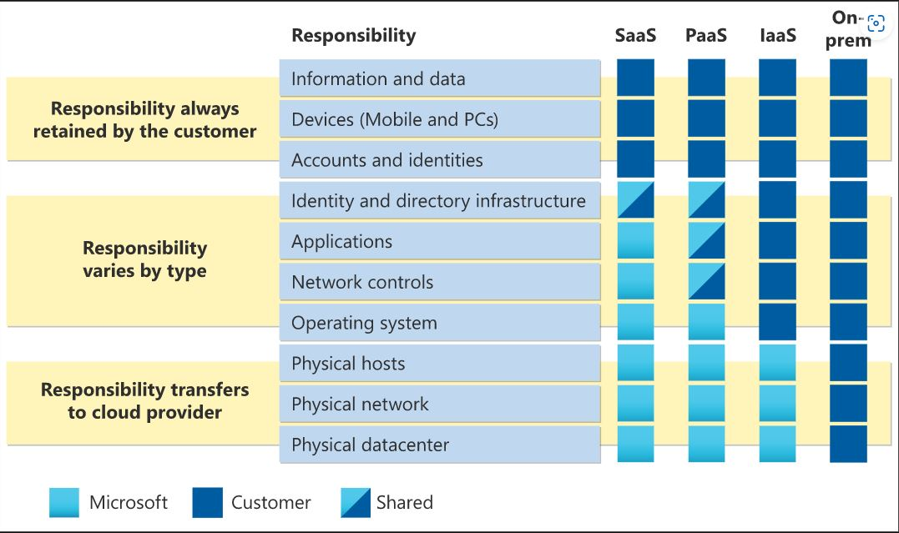

## Beschreiben des Cloud-Computings

Da ich bereits einige Berührungspunkte während der Arbeit mit der Cloud hatte, ist mir dies kein Fremdwort. Hauptsächlich habe ich mit Microsoft Intune und Office 365 zu tun. Teilweise habe ich auch Einblicke in das Azure Active Directory. Einiges was in diesem Modul beschrieben wird, kannte ich bereits, weshalb dies eine Repetition für mich ist. Nichtsdestotrotz möchte ich einige Begriffe vertieft analysieren und dokumentieren. Es handelt sich hierbei um das Shared Responsiblity Model und die Abgrenzungen von IaaS, PaaS und SaaS.
Beim Shared Responsibility Model handelt es sich um die Verantwortlichkeitsaufteilung zwischen dem Cloudanbieter und des Konsumenten. In den verschiedenen Services wird genauer unterteilt, wer wieviel Verantwortung hat.
Beim *Infrastructur as a Service (IaaS)* Model liegt die Verwantwortung für das warten der Hardware,Netzwerks und Datacenter beim Provider. Alles darüberliegende liegt im Verantwortungsbereichs des Konsumenten.
Beim *Platform as a Service (PaaS)* Model werden je nach bezogenen Service die Verantwortung aufgeteilt,

[Quelle Screenshot: Responsibility Model](../4_Anhang/Quellenangabe.md#IaaS,PaaS und SaaS)

## Inhaltsverzeichnis

[2. Hauptteil](./README.md)

[Titelseite (Hauptinhaltsverzeichnis)](../README.md)
