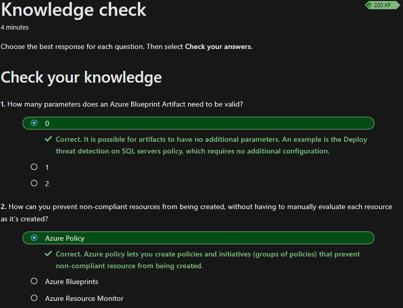

## Beschreiben von Azure-Features und -Tools für Governance und Compliance

Da ich beim Zusammenfassen vom Thema *Governance and Compliance* Mühe hatte das Thema zu verstehen, werde ich hier die Tools für die Verwendung von *Governance and Compliance* zusammenfassen.

## Zweck von Azure Blueprints

*Azure Blueprints* sind wie der Name schon sagt "Vorlagen" für die Organisation. Wenn man z.B. eine neue Subscribtion hinzufügt, muss man nicht alles neu konfigurieren, sondern kann mit *Azure Blueprints* die vordefinierte Konfiguration erneut anwenden.

## Was sind Artifacts?

Jede Komponente in einem *Blueprint* wird als *artifact* bezeichnet. *Artifacts* müssen keine, können aber, eine weitere Konfiguration enthalten.

## Zweck von Azure Policy

Mit *Azure Policy* können Richtlinien für die Überwachung von Ressourcen erstellt werden. Somit können Benachrichtigungen geschaltet werden, wenn Anpassungen an Ressourcen vorgenommen werden. Mit *Azure Policy* kann sichergestellt werden, dass Cloud-Ressourcen den gewünschten Vorgaben entsprechen und diese eine konsistente Konfiguration aufweisen.

### Wie werden Azure Policy Richtlinien definiert?

Mit *Azure Policy* wird das Definieren von individuellen Richtlinien sowie Gruppen von verwandten Richtlinien, sogenannten Initiativen ermöglicht. Azure Policy überprüft Ressourcen und markiert solche, die nicht mit den definierten Richtlinien konform sind. *Azure Policy* kann auch das Erstellen von nicht konforme Ressourcen verhindern.

Azure-Richtlinien können auf verschiedenen Ebenen festgelegt werden, z. B. für spezifische Ressourcen, Ressourcengruppen, Abonnements usw. Zudem werden diese vererbt. Beispielsweise erhalten alle Ressourcen, die in einer Recourcegroup erstellt werden, automatisch dieselbe Azure-Richtlinie.

### Für was gibt es Azure Policy initiatives?

Mit *Azure Policy initiatives* können verwandte Richtlinien gruppiert werden. 

## Wissenscheck

Zum Schluss habe ich den Wissenscheck erfolgreich absolviert und kann nun mit dem nächsten Thema starten.

## Kurze Reflexion

Da das Modul selbst nicht so gross und diesmal einfach zu verstehen war, musste ich nicht allzu viel zusammenfassen. Ich verstehe jedoch das Thema *Azure-Blueprint Artifacts* noch nicht ganz und habe mich meine Fachexperten gewendet, mit welchen ich jetzt im Gespräch bin. Mir ist nicht ganz klar, ob alle *Artifact* nun gänzlich ohne Parameter gültig sind oder ob dies nur vereinzelt gilt. Den Wissenscheck habe ich bestanden, in welchem diese Frage sogar auftauche. Ich habe diese so beantwortet, wie ich es verstanden habe und sie war korrekt.

## Inhaltsverzeichnis

[2. Hauptteil](./README.md)

[Titelseite (Hauptinhaltsverzeichnis)](../README.md)
