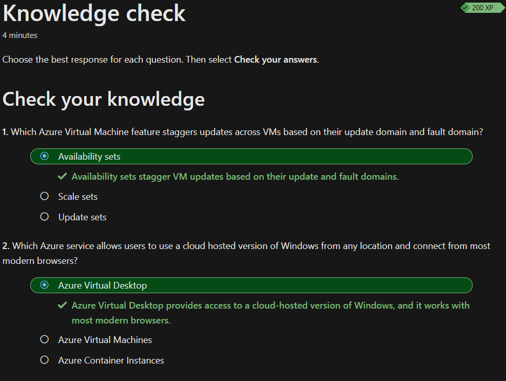

## Beschreiben von Azure Compute- und Azure Netzwerkdiensten

Vieles unter dem Thema *Azure Compute- und Azure Netzwerkdiensten* kannte ich noch nicht, weshalb ich die gelernten Themen zusammengefasst habe.

### Virtual Machine Scale Sets

*Virtual Machine scale Set* ist in anderen worten die Horizontale Skalierung von Azure. Mit diesen Scale Sets kann man mehrere Maschinen gleichzeitig konfigurieren und warten. 

### Virtual machine availability sets

Mit *Virtual machine availability set* können hochverfügbare Umgebungen erstellt werden. Diese sind so konzipiert, dass VM's bei einem Update verschoben werden und dass Strom und Netzwerkverbindung unabhängig sind. Diese benefits können durch zwei Arten erreicht werden: *Update domain* und *Fault domain*.

#### Update domain

Hier werden VM's gruppiert, welche gleichzeitig neu gestartet werden können. Dadurch können Updates durchgeführt werden, ohne Angst haben zu müssen, dass eine anderer VM Gruppe offline geht.

#### Fault domain

Hier werden VM's gruppiert, welche eine gemeinsame Strom und Netzwerkverbindung haben sollen. Standardmässig werden VM's in einem *availability set* bis zu drei verschiedenen *Fault domain* aufgeteilt.

Es fallen hier keine weiteren Kosten an. Man bezahlt nur für die VM-Instanz.

### Azure-Container

Eine VM virtualisiert Hardware, wobei ein Container das Betriebssystem virtualisiert.
Ein Container bündelt (containisieren) eine App und ihre Abhängigkeiten und stellen diese als eine Einheit auf einem Container Host bereit. Es können mehrere Container auf einem einzelnen physischen oder virtuellen Host ausgeführt werden. Ein mögliches Beispiel wäre eine 
Entwicklungsumgebungen:

Entwickler können Container verwenden, um ihre Entwicklungsumgebungen zu isolieren. Statt ihre Anwendung direkt auf ihren lokalen Maschinen auszuführen, können sie einen Container erstellen, der alle erforderlichen Abhängigkeiten enthält. Dadurch wird sichergestellt, dass alle Entwickler in derselben Umgebung arbeiten und Probleme aufgrund von Unterschieden in den Entwicklungsstacks vermieden werden.
[Quelle ChatGPT](https://chat.openai.com/)

Zur Veranschaulichung habe ich noch folgendes Bild

[Quelle](../4_Anhang/Quellenangabe#Azure-Container)

Grundsätzlich ist zu sagen, wenn man die volle Kontrolle über die Umgebung benötigt und nicht sehr flexibel sein muss, sollte man sich für VM's entscheiden. Wenn nicht, könnte die Portabilität, Leistungsmerkmale und Verwaltungsfunktionen von Container die besser Wahl sein.

Container können mittels *Azure Container Instances* (PaaS) hochgeladen und dann durch den Dienst ausgeführt werden.

### Azure Functions

Als Alternative zu VM's und Container bietet Azure noch die serverlose Computeoption, *Azure Functions* an. Anders als bei VM's und Containers werden Funktionen durch Ereignisse ausgelöst, sodass keine Ressourcen bereitgestellt werden müssen, wenn kein Ereignis vorhanden ist. Die Wartung von Serverinfrastrukturen fällt somit komplett weg.

### Azure App Services

*Azure App Services* ermöglicht das Erstellen und Hosten von Web-Apps, Hintergrundaufträgen und RESTful-API's in verschiedenster Programmiersprachen, ohne dass man dafür eine Infrastruktur verwalten muss. Der Dienst bietet ausserdem automatisches Skalierung und hohe Verfügbarkeit. *App Services* unterstütz Windows und Linux. Es basiert auf HTTP

### Communcate between Azure resources

Es gibt zwei Möglichkeiten, die Kommunikation zwischen Azure ressources zu ermöglichen.

- Virtuelle Netzwerke können nicht nur eine Verbindung mit einer VM herstellen, sondern auch mit Azure ressources. z.B: Power Apps, Kubernetes Services und Azure virtual machine scale sets.

- Mithilfe von Dienstendpunkten kann eine Verbindung mit anderen Azure-Ressourcentypen herstellen werden, z.B. Azure SQL-Datenbanken und Speicherkonten. Bei diesem Ansatz können mehrere Azure-Ressourcen mit virtuellen Netzwerken verknüpfen, um die Sicherheit zu erhöhen und ein optimales Routing zwischen Ressourcen sichergestellt werden.

### Connect virtual networks

Virtuelle Netzwerke können mittels *Peering* miteinander verknüpft werden. Mit *Peering* wird eine direkte Verbindung von zwei Netzwerken ermöglicht. Der Datenverkehr ist dabei immer privat und durchläuft das Microsoft-Backbone-Netzwerk, aber nie das öffentliche Internet. Durch *Peering* wird ermöglicht, dass Ressourcen in einzelnen virtuellen Netzwerken, miteinander kommunizieren können. Dadurch, dass sich die virtuellen Netzwerke in unterschiedlichen Regionen befinden können, kann man so über Azure ein globales, miteinander verbundenes, Netzwerk erstellen.

### Azure ExpressRoute

Mit Azure ExpressRoute können alle lokalen Netzwerke über eine private Verbindung, die von einem Konnektivitätsanbieter bereitgestellt wird, auf die Cloud von Microsoft erweitert werden. Diese Verbindung wird als ExpressRoute-Leitung bezeichnet.

Die Konnektivität kann über ein Any-to-Any-Netzwerk (IP VPN), ein Point-to-Point-Ethernet-Netzwerk oder eine virtuelle Querverbindung über einen Konnektivitätsanbieter in einer Co-Location-Einrichtung bereitgestellt werden. Da ExpressRoute-Verbindungen nicht das öffentliche Internet nutzen, können ExpressRoute-Verbindungen gleichmässige Latenz sowie höhere Sicherheit, grössere Zuverlässigkeit und schnellere Geschwindigkeit als herkömmliche Verbindungen über das Internet bieten.

### Wissenscheck

Zum Schluss habe ich den Wissenscheck erfolgreich absolviert und kann nun mit dem nächsten Thema starten.

### Kurze Reflexion

Das ganze Thema war ein ziemlicher Brocken... ich musste einige Themen mehrmalig durchgehen, bis ich sie verstanden habe. Die Grösse des Learning-Path's empfand ich hier für zu gross. Die Themen sind eher komplex. Was mir sehr geholfen hat waren die Videos, welche einige Module genauer beschrieben haben.

## Inhaltsverzeichnis

[2. Hauptteil](./README.md)

[Titelseite (Hauptinhaltsverzeichnis)](../README.md)
