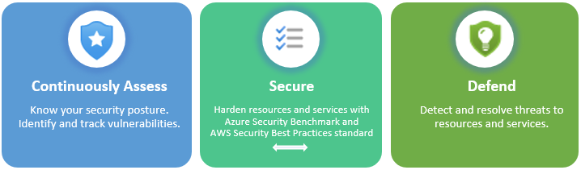
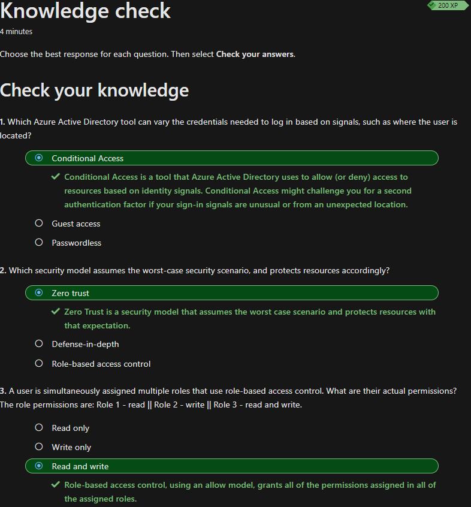

## Identität, Zugriff und Sicherheit in Azure

Viele Themen in diesem Abschnitt kenne ich bereits, da ich schon viel Berührungspunkte mit Azure Active Directory und Zugriffssicherheit habe.
Themen, die ich noch nicht kannte, werde ich trotzdem kurz zusammenfassen.

## FIDO2 security keys

Mit *FIDO2* kann man sich Passwortlos an einem Gerät anmelden. Man hat hierfür meist ein USB-Gerät, welches man am Gerät einsteckt und dann an Anmeldebildschirm die Anmeldemethode wechselt. Es gibt auch Lösungen, welche mittels NFC oder Bluetooth funktionieren.

## Azure external identities

Mit *Azure external identities* kann man z.B. Händlern oder Lieferanten Zugriff auf den Azure Tenant gewähren, ohne dass diese sich mit einem anderen Account anmelden müssen.

External identities beinhaltet folgende Funktionen:

- Business to business (B2B) collaboration: Hier können externe Benutzer sich mit ihrer eigenen Identität anmelden. Sie werden als *guest user angezeigt
- B2B direct connect : Hier wird eine gegenseitige bidirektionale Vertrauensstellung zu einer anderen Azure Organisation aufgebaut. Direkte B2B-Verbindung unterstützt momentan freigegebene Teams-Kanäle, sodass externe Benutzer von den eigenen Instanzen aus, von Teams aus auf die Ressourcen zugreifen können. Diese Benutzer sind nur über Teams-Kanäle sichtbar.
- Azure AD business to customer (B2C) : *Azure B2C* verwaltet die Identität und Zugriff für veröffentlichte SaaS-Apps oder selbst entwickelte Apps für Konsumenten.

## Azure role-based access control (RBAC)

Mit *RBAC* können Berechtigungen via vordefinierten Rollen, selbst erstellten Rollen oder einzeln erteilt werden. Diese Berechtigungen können auf Ressourcen oder Ressourcengruppen angewandt werden.

## Defend resources running on other clouds

Defender für Cloud kann Ressourcen in anderen Clouds z.B. AWS und GCP schützen.

Wenn man beispielsweise ein AWS-Konto mit einem Azure-Abonnement verbindet, können div. Schutzfunktionen aktiviert werden.

## Assess, Secure, and Defend

Der Defender für Cloud erfüllt drei wichtige Anforderungen, wenn man die Ressourcen und Workloads in der Cloud und lokal verwaltet.
Hier werden diese drei Anforderungen etwas genauer erklärt:

- Continuously assess: Kennen des Sicherheitsstatus. Ermitteln und verfolgen von Sicherheitsrisiken.
- Secure: Härten der Ressourcen und Dienste mit *Azure Security Benchmark*.
- Defend: Erkennen und beheben von Bedrohungen für Ressourcen, Workload und Dienste

Im folgenden Abbild sind diese drei Anforderungen nochmals beschrieben:

## Wissenscheck

Zum Schluss habe ich den Wissenscheck erfolgreich absolviert und kann nun mit dem nächsten Thema starten.

## Kurze Reflexion

Viele der behandelnden Themen kannte zum Glück bereits, weshalb ich mit dem Lernen für diesen Abschnitt relativ schnell durch war. 

## Inhaltsverzeichnis

[2. Hauptteil](./README.md)

[Titelseite (Hauptinhaltsverzeichnis)](../README.md)
