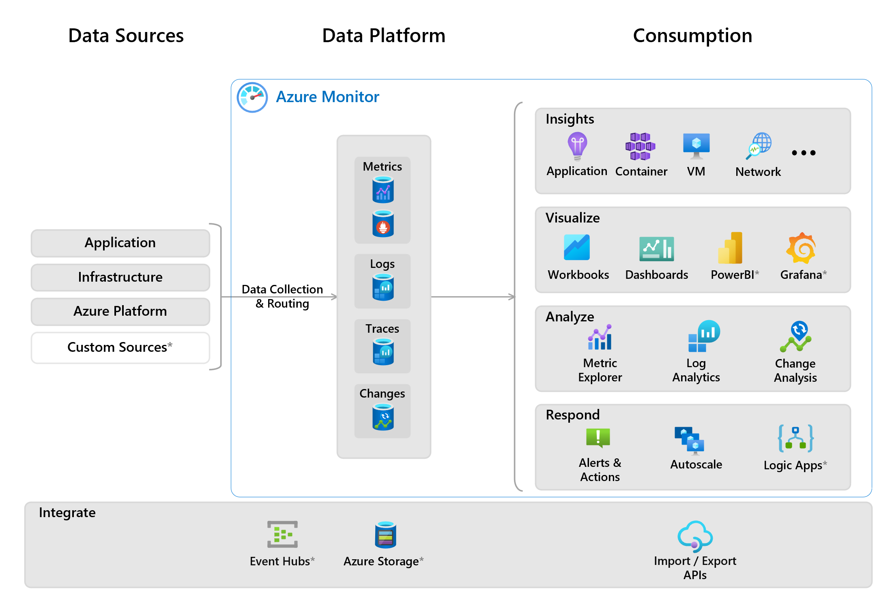
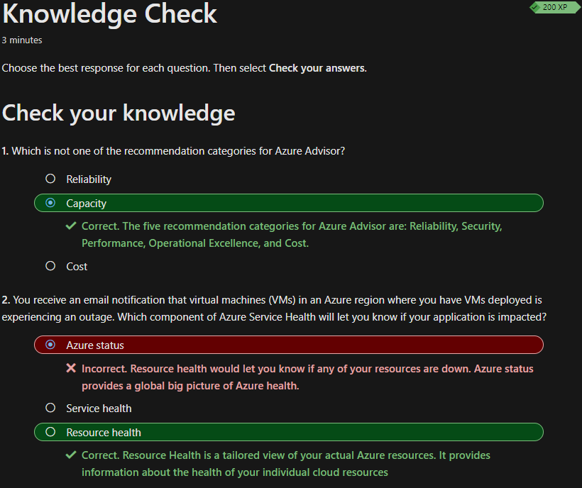

## Beschreiben von Überwachungstools in Azure

Wie bei den vorherigen Themen werde ich die für mich neu erlerntes kurz zusammenfassen.

Grundsätzlich geht es in diesem Thema, wie der Titel schon besagt, um die Tools zur überwachung von Azure und Onprem Umgebungen.

## Azure Advisor

*Azure Advisor* ist der Empfehlungsdienst von Azure. Er wertet die eingerichteten Ressourcen aus und stellt Empfehlungen bereit. Ziel des *Advisors* ist die Verbesserung der Zuverlässigkeit, Sicherheit, Leistung und die Reduktion der Kosten. Die Empfehlungen werden in 5 Kategorien unterteilt:

- Reliability: Ist für die Sicherstellung und Verbesserung der Persistenz der unternehmenskritischen Anwendungen zuständig
- Security: Ist für das Erkennen von Bedrohungen und Sicherheitsrisiken zuständig
- Performance: Ist für die Verbesserung, Leistung und Geschwindigkeit der Anwendungen zuständig
- Operational Excellence: Ist für die Optimierung von Prozess und Workfloweffizienz, Ressourcenverwaltbarkeit zuständig
- Cost: Ist für die Optimierung und Reduzierung der Kosten in Azure zuständig

Im folgenden Abbild sieht man das Dashboard des *Advisors* eines meiner Kunden:

Bei diesem ist mir dann aufgefallen, dass es einige Empfehlungen geben würde, worauf ich auf *Costs* (Kosten) navigiert habe. Dort habe ich dann gesehen, dass ein virtueller Datenträger keine Serverinstanz zugewiesen ist. Die *Empfohlene Aktion* dafür lautet "Sie verfügen über Datenträger, die seit mehr als 30 Tagen nicht an einen virtuellen Computer angefügt wurden. Bewerten Sie, ob Sie den Datenträger noch benötigen." Ich habe darauf hin meinen vorgesetzten informiert, dass wir hier beim Kunden eventuell kosten einsparen könnten. 

Folgendes Bild zur Veranschaulichung:

Ich habe keine Quelle für die 2 Screenshots eingepflegt, da nur ich oder der Kunde auf diese Zugriff hätten.

## Azure Service Health

*Azure Service Health* ist ein Dienst von Azure, der Echtzeitinformationen über den Status der *Azure-Services* bereitstellt. Es informiert über geplante Wartungsarbeiten, Serviceunterbrechungen und andere Ereignisse, die sich auf die Verfügbarkeit von *Azure-Services* auswirken können. *Azure Service Health* liefert detaillierte Benachrichtigungen und Updates, um Konsumenten bei der Überwachung und Problemlösung zu unterstützen. *Service Health* enthält dazu drei verschiedene *Azure-Services*:

- Azure Status: *Azure Status* informiert über globale Auswirkungen auf die Azure-Infrastruktur.
- Service Health: *Service Health* ist ein Teil von *Azure Service Health* und liefert Echtzeitinformationen über den Status der Azure-Dienste. Somit können Ausfallzeiten minimiert und eine optimale Leistung sichergestellt werden.
- Resource Health: *Resource Health* ist eine Funktion von *Azure Service Health*, die sich auf den Zustand einzelner Ressourcen in einer Azure-Umgebung bezieht.

## Azure Monitor

*Azure Monitor* ist eine Plattform für das Sammeln von Daten aus *Azure-Resources*. Diese Daten werden analysiert, die Informationen visualisiert. *Azure Monitor* kann aus diese gewonnenen Ergebnisse sogar reagieren. *Azure Monitor* ist nicht nur auf die Azure-Cloud beschränkt, sogar kann auf Multi-Cloud eben und sogar Onprem erweitert werden.

Im folgenden Bild wird veranschaulicht, wie umfangreich *Azure Monitor* ist:

[Quelle](../4_Anhang/Quellenangabe#Availability-Zones)

## Azure Log Analytics

*Azure Log Analytics* ermöglicht, Protokolldaten aus verschiedenen Quellen zu sammeln, zu speichern und zu analysieren. Mit *Log Analytics* können Protokolldaten in Echtzeit durchsucht, abgefragt und visualisiert werden.

## Application Insights

*Application Insights*, ein *Azure Monitor-Feature* und überwacht Webanwendungen. *Application Insights* kann Anwendungen überwachen, die in Azure, lokal oder in einer anderen Cloudumgebung ausgeführt werden

Folgende Informationen können mit *Application Insights* überwacht werden:

- Anforderungsraten, Antwortzeiten und Fehlerraten
- Abhängigkeitsraten, Antwortzeiten und Fehlerraten zum Ermitteln, ob die Leistung durch externe Dienste beeinträchtigt wird.
- Informationen zu Seitenansichten und Ladeleistung, die von den Browsern der Benutzer gemeldet werden
- AJAX-Aufrufe von Webseiten mit Informationen zu Raten, Antwortzeiten und Fehlerraten
- Anzahl von Benutzern und Sitzungen
- Leistungsindikatoren von Windows- oder Linux-Servercomputern, z. B. zu CPU, Arbeitsspeicher und Netzwerkauslastung

## Wissenscheck

Ich hatte einen Fehler beim letzten Wissenscheck, woraufhin ich das Thema nochmals durchgelesen habe. Darum habe mich auch gleich hinterfragt, warum ich die Antwort falsch ausgewählt habe. Ich habe die Frage nicht sauber durchgelesen und war der Meinung, dass ein Standort komplett down ist.

## Kurze Reflexion

Ich konnte die Themen schnell durcharbeiten, da diese für mich nicht schwierig zu verstehen waren. Ich hatte jedoch beim Wissenscheck einen Fehler, weil ich mich nicht richtig auf die Frage konzentriert habe. Da dies das letzte Kapitel im Learning-Path war und ich meinem Zeitplan voraus bin, werde ich die Zeit nutzen, um mich auf die AZ-900 Zertifizierung vorzubereiten. 

## Inhaltsverzeichnis

[2. Hauptteil](./README.md)

[Titelseite (Hauptinhaltsverzeichnis)](../README.md)
