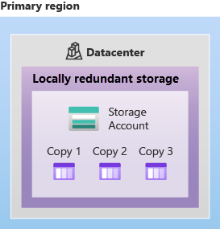
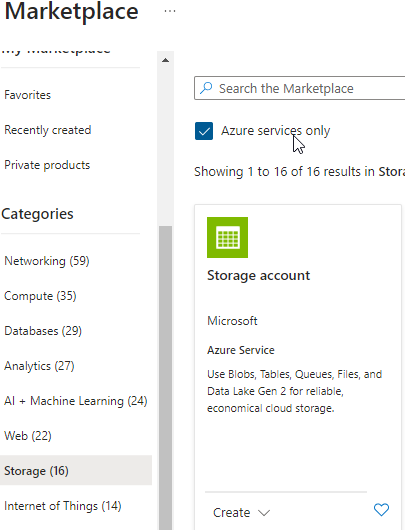

## Grundlegendes zu Azure-Speicherdiensten

Vieles zum Thema *Azure-Speicherdienst* kannte ich noch nicht, weshalb ich die gelernten Themen zusammengefasst habe.

### Azure storage accounts

Ein Speicherkonto stellt einen eindeutigen Namespace für die Azure Storage-Daten bereit, auf welche man von überall auf der Welt per HTTP oder HTTPS zugreifen kann. Die Daten in diesem Account sind sicher, hochverfügbar, langlebig und skalierbar.

Beim Erstellen eines Speicherkontos muss man zunächst den Speicherkontotyp auswählen. Der Kontotyp bestimmt, welche Speicherdienste und Redundanzoptionen und hat Auswirkungen auf die Anwendungsfälle.
Hier sind die möglichen Redundanzoptionen aufgelistet:

- Locally redundant storage (LRS)
- Zone-redundant storage (ZRS)
- Geo-redundant storage (GRS)
- Geo-zone-redundant storage (GZRS)
- Read-access geo-redundant storage (RA-GRS)
- Read-access geo-zone-redundant storage (RA-GZRS)

Diese Tabelle beschreibt diese Optionen noch etwas mehr:

| Typ                    | Unterstützte Dienste                                                                          | Redundanzoptionen                    | Verwendung                                                                                                                                                                                                                                                                             |
| ---------------------- | --------------------------------------------------------------------------------------------- | ------------------------------------ | -------------------------------------------------------------------------------------------------------------------------------------------------------------------------------------------------------------------------------------------------------------------------------------- |
| Standard „Allgemein v2 | Blob Storage (einschließlich Data Lake Storage), Queue Storage, Table Storage und Azure Files | LRS, GRS, RA-GRS, ZRS, GZRS, RA-GZRS | Standard-Speicherkontotyp für Blobs, Dateifreigaben, Warteschlangen und Tabellen. Empfohlen für die meisten Azure Storage-Szenarien. Wenn Sie Unterstützung für NFS-Dateifreigaben (Network File System) in Azure Files wünschen, verwenden Sie den Kontotyp „Premium-Dateifreigaben“. |
| Premium-Blockblobs     | Blob Storage (einschließlich Data Lake Storage)                                               | LRS, ZRS                             | Kontotyp „Premium Storage“ für Block- und Anfügeblobs. Empfohlen für Szenarien mit hohen Transaktionsraten, die kleinere Objekte verwenden oder aber eine gleichbleibend geringe Speicherlatenz erfordern.                                                                             |
| Premium-Dateifreigaben | Azure Files                                                                                   | LRS, ZRS                             | Kontotyp „Premium Storage“ nur für Dateifreigaben. Empfohlen für Unternehmens- oder Hochleistungsanwendungen. Verwenden Sie diesen Kontotyp, wenn Ihr Speicherkonto sowohl SMB- (Server Message Block) als auch NFS-Dateifreigaben unterstützen soll.                                  |
|Premium-Seitenblobs|Nur Seiten-BLOBs|LRS|Storage Premium-Kontotyp nur für Seitenblobs.|

[Quelle Tabelle: Speicherkontotypen](../4_Anhang/Quellenangabe.md#Tabelle-der-Kontospeichertypen)

### Azure storage redundancy

*Azure Storage* speichert immer mehrere Kopien der Daten, damit diese vor geplanten und ungeplanten Ereignissen geschützt sind. Diese *redundancy* ist nicht gratis. Man muss sich also überlegen, welche Redundanzoption man auswählt, um zwischen geringen Kosten und höhere Verfügbarkeit einen guten Kompromiss zu finden.

### Redundancy in the primary region

Daten in einem Azure Storage-Konto werden immer dreimal in der primären Region repliziert. Azure Storage bietet mit dem *locally redundant storage* (LRS) und dem *zone-redundant storage* (ZRS) zwei Optionen für die Replikation der Daten in der *primary region* an.

#### Locally redundant storage (LRS)

Bei der *locally redundant storage* (LRS) werden die Daten in einem einzelnen Rechenzentrum in der *primary region* repliziert. Dies ist die kostengünstigste Redundanzoption und bietet im Vergleich zu den anderen Optionen die geringste Dauerhaftigkeit, diese beträgt mindestens elf Neunen -> 99,999999999% für Azure Storage-Datenobjekte in einem Zeitraum von einem Jahr. Es besteht jedoch grosse Gefahr, dass bei einer Naturkatastrophe und Ausfall des gesamten RZ's, die ganzen Daten inkl. Replikationen verloren gehen.

Zur Veranschaulichung noch folgendes Bild

[Quelle](../4_Anhang/Quellenangabe.md#Locally-redundancy)

#### Zone-redundant storage (ZRS)

Bei Availability Zone-verfügbaren Region's repliziert der *zone-redundant storage* (ZRS) die Azure Storage-Daten synchron in drei Azure Availability Zone's in der *primary region*. Der ZRS bietet somit eine Dauerhaftigkeit von mindestens zwölf Neunen -> 99,9999999999 % für Azure Storage-Datenobjekte in einem Zeitraum von einem Jahr an. Durch ZRS kann bei einem Ausfall von einer Availability Zone weiterhin mit Lese- und Schreibvoränge zugegriffen werden.

Zur Veranschaulichung noch folgendes Bild

[Quelle](../4_Anhang/Quellenangabe.md#Zone-redundancy)

### Redundancy in a secondary region

Fall der Bedarf da ist, Anwendungen oder Daten mit hoher Dauerhaftigkeit ablegen zu können, bietet Azure zusätzlich noch die Möglichkeit diese in eine *secondary region* zu kopieren. Wenn ein Speicherkonto erstellt wird, wählt man erst die *primary region* aus. Die gekoppelte *secondary region* basiert auf Azure-Regionspaaren und kann nicht geändert werden.

Azure bietet zwei Möglichkeiten zum Kopieren der Anwendungen und Daten in die *secondary region*, *geo-redundant storage* (GRS) und *geo-zone-redundant storage* (GZRS).
GRS ähnelt der Nutzung des LRS in zwei Regionen, und der GZRS ähnelt der Nutzung des ZRS in der primären und des LRS in der sekundären Region.
Die Daten in der *secondary region* sind standardmässig für Lese- oder Schreibzugriff erst dann verfügbar, wenn ein Failover in die *secondary region* erfolgt. Nachdem das Failover abgeschlosse ist, wird aus der *secundary region* die *primary region*

### Geo-redundant storage (GRS)

GRS erstellt mit der Verwendung von *locally redundant storage* (LRS) drei synchrone Kopien der Daten an einem einzigen physischen Standort in der *primary region*. Anschliessend werden diese Daten dann mithilfe von LRS asynchron an einen einzelnen phyischen Standort in der *secondary region* (Region pair) kopiert. Somit kann GRS eine Dauerhaftigkeit von mindestens 16 Neunen -> 99,99999999999999 % für Azure Storage-Datenobjekte in einem Zeitraum von einem Jahr bieten.

Zur Veranschaulichung noch folgendes Bild

[Quelle](../4_Anhang/Quellenangabe.md#Geo-redundant-storage)

### Geo-zone-redundant storage (GZRS)

Der *geo-zone-redundant storage* (GZRS) in eine Kombination aus *zone-redundant storage* (ZRS) und *geo-redundant storage (GRS)*. GZRS kombiniert somit die Hochverfügbarkeit durch die verfügbarkeitszonenübergreifende Redundanz mit dem Schutz vor regionalen Ausfällen. Somit kann GZRS eine Dauerhaftigkeit von mindestens 16 Neunen -> 99,99999999999999 % für Azure Storage-Datenobjekte in einem Zeitraum von einem Jahr bieten.

Zur Veranschaulichung noch folgendes Bild

[Quelle](../4_Anhang/Quellenangabe.md#Geo-zone-redundant-storage)

### Lesezugriff auf Daten in der secundary region

Standardmässig kann man auf die Daten in der *secondary region* erst dann zugreifen, wenn diese als Failover aktiv wird. Man kann diese Lesezugriff aber schon vorher mittels *read-access geo-redundant storage* (RA-GRS) oder *read-access geo-zone-redundant storage* (RA-GZRS) freischalten. Wichtig ist aber zu beachten, dass die Daten möglicherweise nicht den gleichen Datenstand durch die *Recovery Point Objectiv* (RPO) aufweisen. Die RPO gibt den Zeitpunkt an, auf den Daten wiederhergestellt werden können. Azure Storage weist normalerweise einen RPO-Wert von weniger als 15 Minuten auf.

## Azure storage services

Azure bietet folgende Storage-Plattformen als Datendienste:

- Azure-Blobs
- Azure Files
- Azure-Queues
- Azure-Disks

### Blob storage

*Azure Blob storage* ist ein cloudbasierter Speicherdienst, der für die Speicherung grosser Mengen, unstrukturierter Daten wie Bilder, Videos, Dokumente und Backups verwendet wird. *Blobs* sind nicht auf gängige Dateiformate beschränkt.

Hier sind einige Beispiele für die Verwendung von *Azure Blob storage*:

- Speichern von Bildern oder Dokumenten direkt für einen Browser
- Speichern von Dateien für verteilten Zugriff
- Video- und Audio-Streaming
- Speichern von Daten für Sicherung und Wiederherstellung, Notfallwiederherstellung und Archivierung
- Speichern von Daten für Analysen durch einen lokalen oder von Azure gehosteten Dienst

### Zugreifen auf Blob storage

Über die Protokolle HTTP und HTTPS kann man von überall auf der Welt auf die Daten, welche sich auf dem Blobspeicher befinden, zugreifen. Benutzer oder Clientanwendungen können über die Azure Storage-REST-API, URL's, Azure PowerShell, Azure CLI oder eine Azure Storage-Clientbibliothek auf den Blob's zugreifen.

### Blob storage tiers

Azure Storage bietet verschiedene Zugriffsebenen für den Blobspeicher an, welche es ermöglichen, Objektdaten auf kostengünstige Weise zu speichern.

Azure bietet folgende *access tier's*:

- Hot: Optimiert für das Speichern von Daten, auf die häufig zugegriffen wird (z.B. Bilder für Ihre Website).
- Cool: Optimiert für Daten, auf die selten zugegriffen wird und die mindestens 30 Tage lang gespeichert werden (z.B. Rechnungen für Ihre Kunden).
- Archive: Daten optimiert, auf die selten zugegriffen wird und die bei flexiblen Latenzanforderungen mindestens 180 Tage lang gespeichert werden (z.B. langfristige Sicherungen oder Jahressicherungen).

Was ich noch für wichtig empfinde, sind folgende Fakten oder Überlegungen:

- Nur die hot- und cold access tier's können auf Kontoebene festgelegt werden. Die Archivspeicherebene ist auf der Kontoebene nicht verfügbar.
- Die hot- und cold access tier's und die Archivspeicherebene können während des Uploads oder danach auf Blobebene festgelegt werden.
- Das archive access tier speichert Daten offline und zeichnet sich durch besonders niedrige Speicherkosten aus, verursacht aber gleichzeitig sehr hohe Kosten beim Aktivieren von und Zugreifen auf Daten.
- Bei den Daten des cold acess tiers können geringfügige Abstriche bei der Verfügbarkeit gemacht werden. Dauerhaftigkeit, Abrufwartezeit und Durchsatz müssen sich jedoch auf einem ähnlich hohen Niveau befinden wie bei Daten des hot access tier's. Daher kann bei Daten des cold access tier's eine Kombination aus eines Service-Levelagreement (SLA) mit etwas niedrigerer Verfügbarkeit und höheren Zugriffskosten im Vergleich zu Daten des hot access tiers's in Kauf genommen werden, um im Gegenzug die Speicherkosten zu verringern.

### Azure Files

*Azure Files* ist im Grunde ein zentrale Fileablage in der Azure Cloud, welche über die Protokolle SMB und NFS zugegriffen werden kann. Man kann *Azure Files* mit einem NAS oder einem SAN vergleichen. 

### Queue storage

*Queue storage* wird verwendet, um grosse Nachrichtenmengen zu speichern. Nach der erfolgreichen Speicherung können Sie von überall auf der Welt über HTTP oder HTTPS abgerufen werden. Jede einzelne Nachricht kann bis zu 64KB gross sein.
Wofür wird nun *Queue storage* verwendet?
*Queue storage* könnte man für Hintergrundverarbeitung verwenden. Es eignet sich gut für Aufgaben, die im Hintergrund oder zeitgesteuert verarbeitet werden sollen. Anwendungen können Nachrichten in die Warteschlange stellen, die dann von einem oder mehreren Verarbeitungsdiensten abgerufen und verarbeitet werden.

### Disk storage

*Disk storage* ersetzen die physischen Festplatten in einem Server. *Disk storage* wird für die Verwendung von Azure-VM's eingesetzt. Bei der Verwaltung von den *Disks* muss nur die Provisionierung gemacht werden. Der Rest wird von Azure übernommen.

## Praxisbeispiel Speicherblob Erstellung

In diesem Praxisbeispiel werde ich auf dem Azure-Portal einen *Azure blob Storage* erstellen.

Als Erstes meldet man sich auf [Home - Microsoft Azure](https://portal.azure.com/#home) an.

Dann navigiert man auf *Ressource groups*

Durch den Learning-Path wurde mir bereits eine *Recource group* erstellt, weshalb ich diese nicht noch erstellen muss.
Ich habe dann diese angewählt und unter Categories *storage* das Häkchen *Azure service only* gesetzt.

Nun konnte ich einen *Azure Storage account* erstellen. Ich habe die Konfiguration anhand des Learning-Path - Auftrags erstellt. Diese sieht wie folgt aus.

Alle anderer Einstellungen habe ich auf den Default settings gelassen. Anschliessen mit *Review + Create* bestätigen.

Weiter habe ich einen Blobcontainer erstellt und darin ein Bild hochgeladen.

Wichtig ist, dass beim Erstellen des Containers der *Public access level* auf *Blob* eingestellt ist. Sonst kann man von extern mit der URL nicht darauf zugreifen.

Nach dem Upload eines JPG konnte ich dieses erfolgreich per URL aufrufen.

Da ich dieses Praxisbeispiel in einer Sandbox des Learning-Paths gemacht habe, kann ich leider keinen gültigen Link mehr aufweisen, auf welchem ein Bild angeschaut werden kann (Will ich auch aus Kosten gründen nicht mache).

## Azure Migrate

*Azure Migrate* ist ein Dienst, welcher die Migration von einer on premise Umgebung zur Cloud unterstützt. Folgendes wird von *Azure Migrate* angeboten:

- Unified migration platform: Ein einzelnes Portal zum Starten, Ausführen und Nachverfolgen der Migration zu Azure
- Range of tools: Eine Reihe von Tools für die Bewertung und für die Migration.
- Assessment and migration: Im Azure Migrate-Hub können lokale Infrastrukturen bewerten und zu Azure migrieren werden.

### Integrierte Tools

- Azure Migrate: Als Vorbereitung für die Migration zu Azure werden lokale Server ermittelt und bewertet, die unter VMware, Hyper-V und auf physischen Servern ausgeführt werden.
- Azure Migrate: Ist das Migrationstools für jegliche Arten von physischen und virtuellen Servern
- Data Migration Assistant: Ist ein eigenständiges Tool zu Bewertung von SQL Server-Instanzen. Es ermöglicht die Analyse von möglichen Problemen, die einer Migration im Weg stehen könnten.
- Azure Database Migration Service: Dient der Migration von lokalen Datenbanken zu Azure-VM's, auf welchen SQL-Server, Azure SQL-Datank oder verwaltete Azure SQL-Instanzen ausgeführt werden.
- Web app migration assistant: Ist ein Migrations Assistent von Azure App Services, mit welchem lokale Webserver für die Migration zu Azure App Services bewerten kann.
- Azure Data Box: Ist für die Migration von grösseren Mengen an Offline Daten

## Inhaltsverzeichnis

[2. Hauptteil](./README.md)

[Titelseite (Hauptinhaltsverzeichnis)](../README.md)
