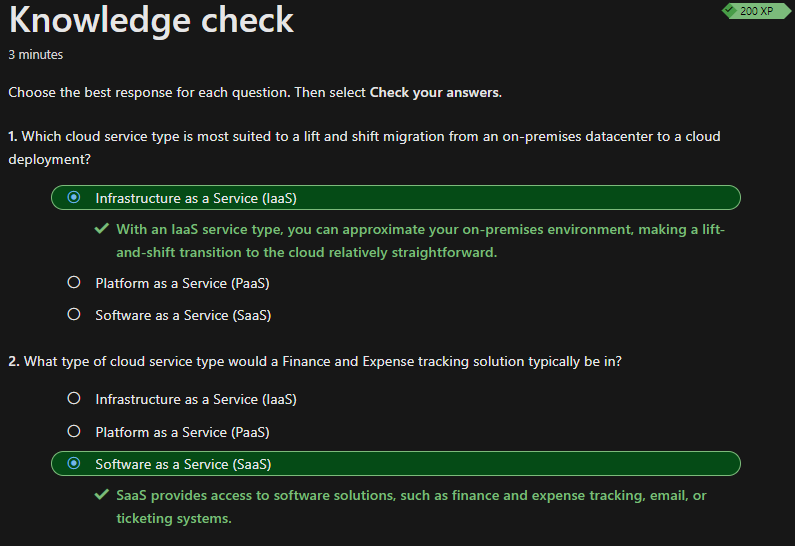

## Grundlegendes zu Clouddiensttypen

Die Clouddiensttypen wurde bereits kurz in der Dokumentation [Beschreiben des Cloud-Computings](./Beschreiben_des_Cloud_Computings.md#Shared-Responsibility-Modells) beschrieben. Hier werde ich die 3 Typen jedoch genauer unter die Lupe nehmen und beschreiben.

In der Azure Cloud gibt es 3 verschiedene Clouddiensttypen. *Infrastructur as a Service (IaaS)*, *Platform as a Service (PaaS)* und *Software as a Service (SaaS)*. Man entscheidet sich, je nach Anwendungsfall oder nötige Flexibilität, für einer der Typen.

### Infrastructur as a Service (IaaS)

*Infrastructure as a Service (IaaS)* ist der flexibelste Typ der Clouddienste, da es einem die grösstmögliche Kontrolle über die Ressourcen bietet. In einem IaaS-Modell ist der Cloudanbieter für die Hardware, die Netzwerkkonnektivität und die physische Sicherheit verantwortlich. Die restliche Verantwortung liegt beim Konsumenten wie z. B. Installation, Konfiguration und Wartung des Betriebssystems, Netzwerkkonfiguration, Datenbank- und Speicherkonfiguration. Der erste Schritt von einer On-premise Umgebung zu einer Cloudlösung zu wechseln ist *Infrastructure as a Service (IaaS)*, da man kein eigenes Rechenzentrum inhouse betreibt, sondern man sich in eines des Cloudanbieters einmietet.

### Mögliche Szenarien

In folgenden Szenarien könnte *IaaS* zum Zug kommen.

- Lift und Shift: Die bestehende Infrastruktur wird 1zu1 in die Cloud migriert. Es finden keine grossen Veränderungen statt. 

- Lift und Reshape: Die bestehende Infrastruktur wird ebenfalls in die Cloud migriert, jedoch kann dies Änderungen an der Architektur, Skalierung, Sicherheit oder der Verwendung von Cloud-spezifischen Diensten und Funktionen beinhalten.

- Test und Entwicklungsumgebungen: IaaS kann genutzt werden, um temporäre Entwicklungsumgebungen bereitzustellen. Mittels Templates können virtuelle Maschinen schnell und einfach bereitgestellt werden. Somit können Entwickler ihre Software in der Umgebung testen. Die Maschinen können dann wieder heruntergefahren oder gelöscht werden.

### Platform as a Service (PaaS)

*Platform as a Service (Paas)* ist die nächste Stufe der Clouddienste. In diesem Modell ist man bereits mehr eingeschränkt. Man hat keinen Zugriff mehr auf die Serverebene und muss diese aber auch nicht mehr bereitstellen. Mit *PaaS* können sich Entwickler Unternehmen Anwendungen entwickeln, bereitstellen und verwalten, ohne sich um die zugrunde liegende Infrastruktur kümmern zu müssen. Azure bietet viele PaaS-Dienste, die auf verschiedene Anwendungsarten und Szenarien zugeschnitten sind, an.

### Mögliche Szenarien

In folgenden Szenarien könnte *PaaS* zum Zug kommen.

- Azure SQL Database: Ein vollständig verwalteter relationale Datenbankdienst, der auf der Microsoft SQL Server-Engine basiert. Entwickler können ihre Anwendungen mit einer skalierbaren und hochverfügbaren Datenbank nutzen, ohne sich um die Serververwaltung kümmern zu müssen. Jedoch ist der Konsument für die Wartung der SQL-Datenbank selbst verantwortlich.

- Skalierbare Datenverarbeitung: Mit *Azure Functions* können Entwickler codebasierte Funktionen erstellen, die in einer serverlosen Umgebung ausgeführt werden. Dadurch können sie auf einfache Weise skalierbare Datenverarbeitungslösungen implementieren, die auf Ereignisse reagieren, wie z.B. das Verarbeiten von Benutzerinteraktionen, das Auslösen von Workflows oder das Analysieren von Streaming-Daten.

- Integration und Workflow-Automatisierung: *Azure Logic* Apps ermöglicht die einfache Erstellung von Workflow- und Integrationslösungen. Somit können Geschäftsprozesse automatisiert, Datenflüsse zwischen verschiedenen Systemen und Anwendungen orchestrieren werden.

### Software as a Service (SaaS)

*Software as a Service (SaaS)* ist die höchste Stufe der Clouddienste. In diesem Modell ist man am meisten flexibel und eingeschränkt. Man mietet oder nutzt vom Cloudanbieter eine fertige Softwarelösung. Man brauch also nur wenig technisches Know-how.

### Mögliche Szenarien

In folgenden Szenarien könnte *SaaS* zum Zug kommen.

- Kollaboration und Produktivität: *Office 365 Produkte*
- Sicherheit und Identitätsmanagement: *Azure Active Directory*
- Customer Relationship Management (CRM): *Microsoft Dynamics 365 Sales und Customer Service*

Da mir die Szenarien im Learning-Path nicht ausgereicht haben, habe ich ChatGPT nach weiteren möglichen Szenarien für die verschiedenen Clouddiensttypen gefragt.

## Wissenscheck

Zum Schluss habe ich den Wissenscheck erfolgreich absolviert und kann nun mit dem nächsten Thema starten.

## Kurze Reflexion

Ich konnte diesen Abschnitt schnell durcharbeiten, da dieser nicht gross, dafür einfach zu verstehen war. Was mir am meisten geholfen hat, die einzelnen Clouddiensttypen zu unterscheiden sind die waren die Anwenderszenarien.

## Inhaltsverzeichnis

[2. Hauptteil](./README.md)

[Titelseite (Hauptinhaltsverzeichnis)](../README.md)
