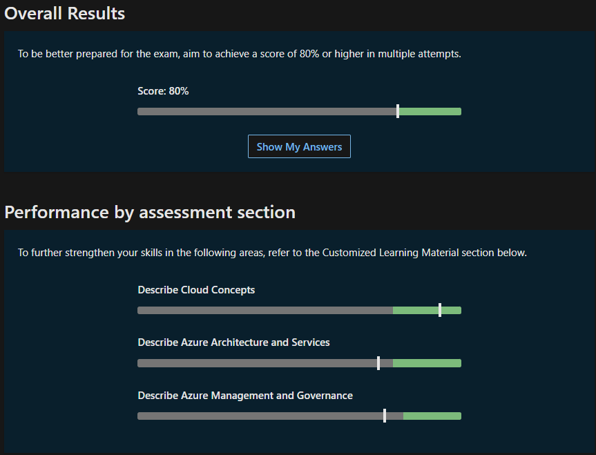

## Übungsassessments

Um meine Lernerfolge auch auswerten zu können, werde ich hier einige meiner Testresultate von den *Practice Assessment for Exam AZ-900* ausweisen.

23.06.2023 - 18:45

Ich habe die Prüfung neben den Pausen während des Frontalunterrichts von Armin durchgeführt, weshalb ich nicht 100% auf die Prüfung fokussiert war. Deshalb habe ich einige Flüchtigkeitsfehler gemacht. Für die erste absolvierte Prüfung ist das Ergebnis jedoch nicht schlecht.

