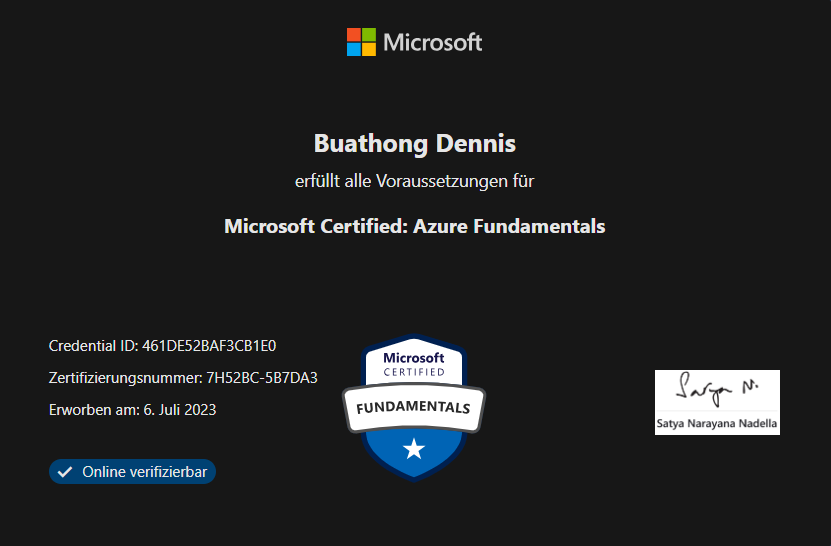

## Vorbereitung auf die Zertifizierung

Ich habe nach dem Abschluss des Learning-Path's die Probeprüfungen von Microsoft einige Male durchgespielt, bis ich immer 90 % richtig hatte. Bei Fragen, die ich falsch beantwortet habe, habe ich mich erneut an meine Zusammenfassung gesetzt und das Thema nochmals durchgelesen.

## Zertifizierung

Ich darf mit Freude verkünden, dass ich die Microsoft AZ-900 Zertifizierung erfolgreich bestanden habe und somit eines meiner Ziele für meine Semesterarbeit abhacken kann.

Ich war ein bisschen über die Fragen überrascht, weil ich dachte, dass diese genau so kommen wie in den Übungsprüfungen. Bei vielen Fragen musste ich jedoch wählen, ob die Aussage richtig oder falsch ist.

## Lession learned

Am Zeitplan hätte ich mehr arbeiten sollen. Ich habe nicht richtig eingeschätzt, wie viel Zeit ich effektiv für welches Thema brauche. Das hatte zur Folge, dass ich in der Mitte der Semesterarbeit weniger Zeit für grosse Themen und zu viel Zeit für kleinere Themen am Ende hatte. Ausserdem hätte ich mir von Anfang an fixe Termine setzen sollen, um privat an der Semesterarbeit zu arbeiten. Ich hatte zu wenig Druck auf mich selbst und habe die Arbeit vernachlässigt. Ich habe die Unterrichtsblöcke nicht sauber geplant, dadurch hatte ich das Gefühl viel während der Schulzeit an der Arbeit arbeiten zu können. Ein grosses Problem war auch, dass ich nach dem 1.Sprintabschluss nicht auf den Fehler reagiert habe und die Terminsetzung erst nach dem 2.Sprintabschluss erfolgte. Diese Probleme lassen sich hauptsächlich darauf zurückführen, dass ich die Projektmanagementmethode Scrum in meine Semesterarbeit hätte umsetzen sollen. Auch wenn ich die Zertifizierung bestanden habe, darf ich mich nicht darauf verlassen, dass die Prüfungsfragen so kommen, wie sie in den Übungsassessments aufgeführt wurde. Das werde ich mir für weiter Zertifizierungen zu Herzen nehmen.

## Erreichte Ziele

1.  _Absolvieren und Bestehen der Zertifizierung_
2.  _Umfassende Dokumentation als Tagebuch_
4.  _Dokumentation als Github Repository abgeben_
5.  _Übungen mit eigenen Beispielen ergänzen oder eigene, praxisbezogenes Beispiel erstellen_

## Teilweise erreichte Ziele

3.  _Saubere Projektplanung und Durchführung_

## Nicht erreichte Ziele

-

## Reflexion der ganzen Semesterarbeit

Da dies meine erste Semesterarbeit war, konnte ich sehr viele und gute Erfahrungen machen. Ich habe einige Fortschritte gemacht und habe alle meine Ziele erreicht. Es hat mir enorm geholfen, jedes gelernte Kapitel nochmals kurz zu reflektieren. Ich habe auch einige Fehler gemacht, welche ich aber bereits eingesehen und dokumentiert habe. Diese versuche ich für die nächste Semesterarbeit zu vermeiden. Für meine nächste Semesterarbeit werde ich auch bestimmt nicht mehr so etwas Theorielastiges auswählen, wie diese Semesterarbeit wählen. Da ich aber kein Ziel nicht erreicht habe, ist es für mich eine gelungene Semesterarbeit gewesen.

## Inhaltsverzeichnis

[3. Abschluss](./README.md)

[Titelseite (Hauptinhaltsverzeichnis)](../README.md)