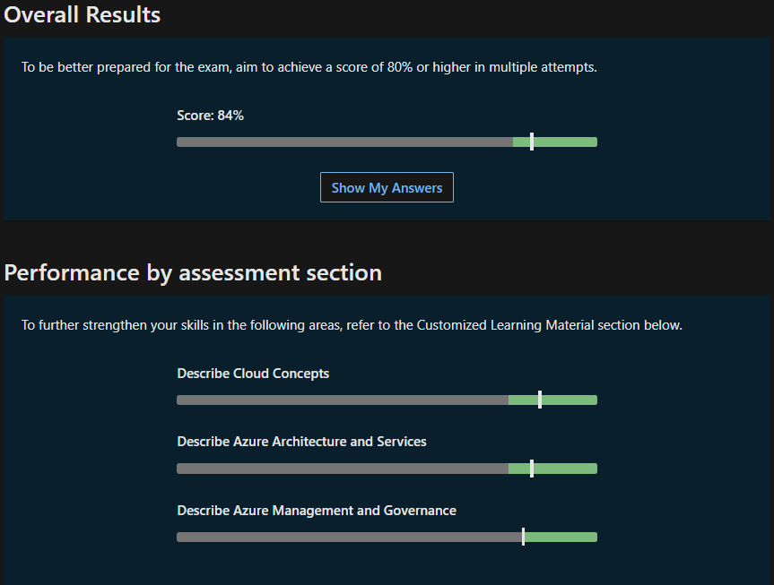
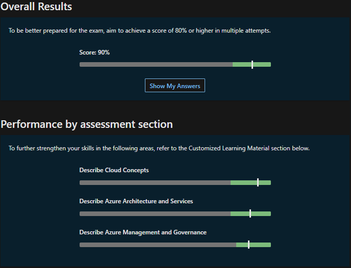
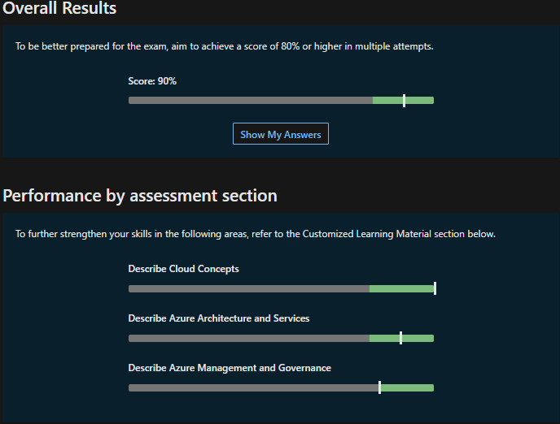
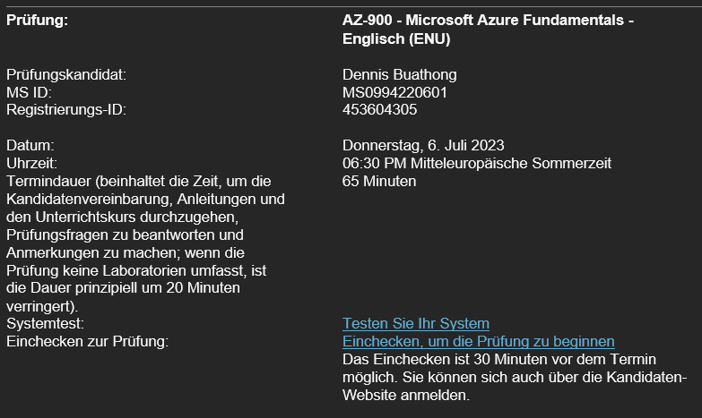

## Übungsassessments

Um meine Lernerfolge auch auswerten zu können, werde ich hier einige meiner Testresultate von den *Practice Assessment for Exam AZ-900* ausweisen.

23.06.2023 - 18:45

Ich habe die Prüfung neben den Pausen während des Frontalunterrichts von Armin durchgeführt, weshalb ich nicht 100% auf die Prüfung fokussiert war. Deshalb habe ich einige Flüchtigkeitsfehler gemacht. Für die erste absolvierte Prüfung ist das Ergebnis jedoch nicht schlecht.

26.06.2023 - 18:45

Ich habe mir die Zeit genommen, um die Prüfung nochmals durchzugehen. Es fällt auf, dass ich bei Governance noch am meisten Mühe habe, weshalb ich das Thema nochmals repetieren werde.

28.06.2023 - 10:35

Die Resultate werden immer besser und ich fühle mich immer sicherer mich für die Zertifizierung anzumelden.

30.06.2023 18:30

Das zweite Testresultat, in welche im mind. 90% erreicht habe. Das bedeutet, dass ich nach der nächsten Prüfung mit 90% mich für die Zertifizierung anmelden werde.

03.07.2023 18:30

Ich habe mein Ziel erreicht und 3x hintereinander mind. 90% korrekt gehabt an der Übungsprüfung und habe mich deshalb für die Zertifizierung angemeldet. Ich werde die Zertifizierung am 06.07.2023 um 18:30 Uhr durchführen.

Natürlich werde ich noch weiter lernen um mich für die Prüfung noch besser vorzubereiten.

## Inhaltsverzeichnis

[3. Abschluss](./README.md)

[Titelseite (Hauptinhaltsverzeichnis)](../README.md)