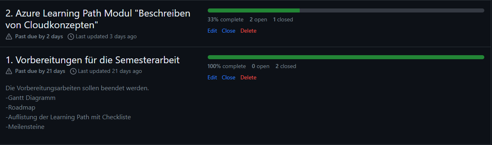
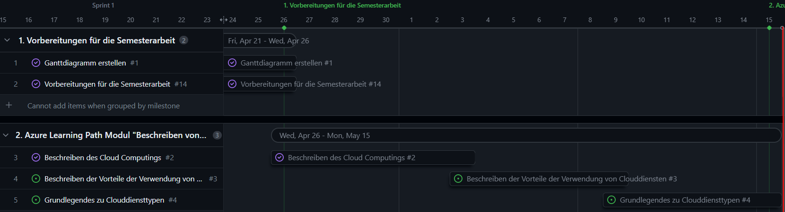
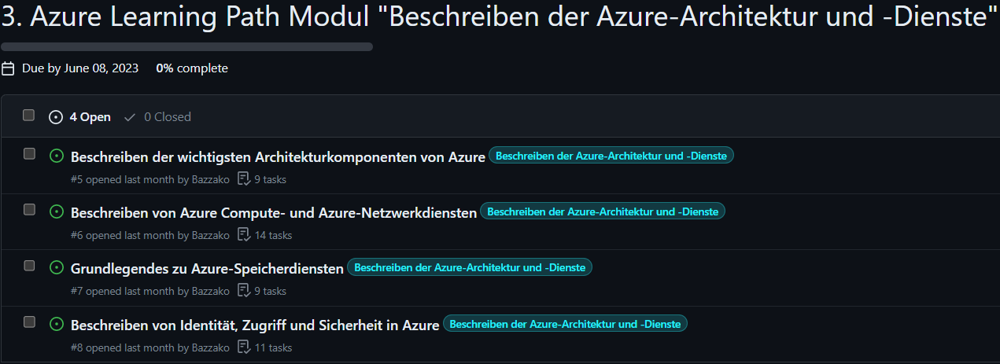

## 1. Sprint Abschluss

Rückblickend auf den ersten Sprint muss ich leider feststellen, dass ich meine Ziele nicht erreicht habe, wie man anhand dieses Screenshots sehen kann. Ich hätte den 2. Meilenstein *Azure Learning Path Modul "Beschreiben von Cloudkonzepten"*  abschliessen müssen.

Im Gantt-Diagramm sieht es aktuell wie folgt aus. Der rote Strich visualisiert das Ende des 1. Sprints.

#### Warum bin ich im Rückstand, was ist nicht gut gelaufen?

Das Problem ist wohl hier, dass ich mich nicht an den Zeitplan gehalten habe und währen den Schulferien nicht soviel an der Semesterarbeit gearbeitet habe, wie ich eigentlich geplant hatte. Ich konnte mich anfangs schwer motivieren. Da aber die Vorbereitungsarbeit für die Dokumentation erfolgreich abgeschlossen wurde, kann ich mich vollkommen der Abarbeitung der Module widmen.

#### Was ist gut gelaufen, worauf baue ich auf?

Mich motiviert es sehr, dass ich die Dokumentation erfolgreich in meine Gitrepository erfassen kann. Das ist für mich ein Erfolgserlebnis, da ich das erste Mal so eine Dokumentation schreibe. Ausserdem will ich die klare Struktur des Dokuments weiterführen.

#### Blick auf den 2. Sprint

Da wir viel Zeit währen dem Unterricht haben an unserer Semesterarbeit zu arbeiten, bin ich zuversichtlich, dass der Rückstand aufgeholt werden kann. Den 2. Sprint möchte ich, nicht wie den 1. Sprint, ohne Rückstand abschliessen. Ich darf die Zeit für die Dokumentation nicht unterschätzen.
Im 2. Sprint muss folgender Meilenstein erreicht werden.

## Inhaltsverzeichnis

[5. Sprintabschlüsse](./README.md)

[Titelseite (Hauptinhaltsverzeichnis)](../README.md)