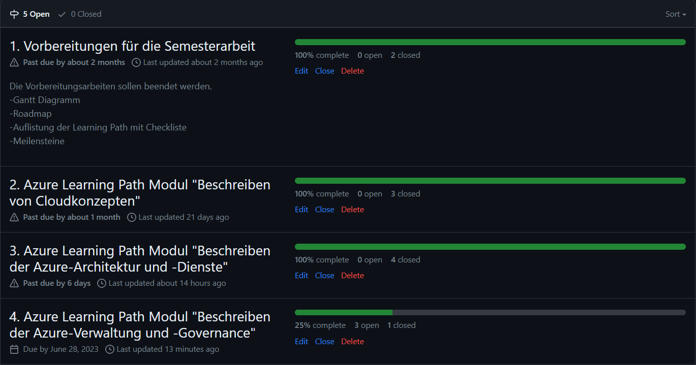
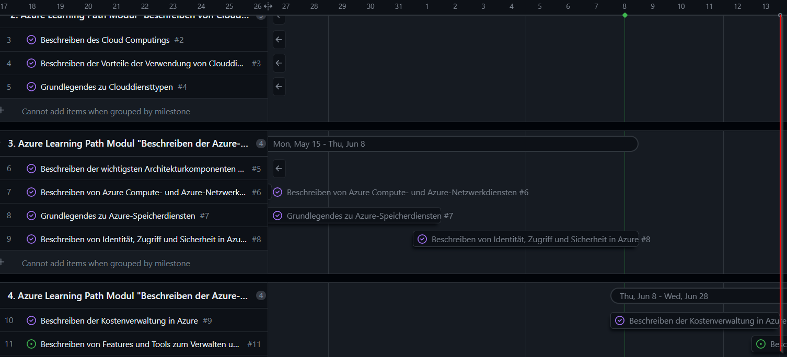
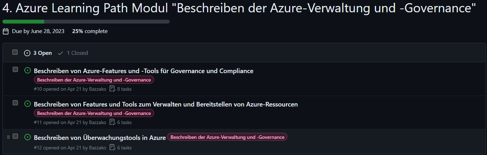

## 2. Sprint Abschluss

Rückblickend auf den Sprintabschluss 2 muss ich sagen, dass ich trotz meines Rückstandes meine Ziele erreicht habe. Das gibt mir persönlich einen Boost, mit derselben Qualität und mehr Arbeitsmoral an die Semesterarbeit zu gehen, damit ich diese Erfolgreich abschliessen kann.

So sieht der momentane Stand aus.

Im Gantt-Diagramm sieht es aktuell wie folgt aus. Der rote Strich visualisiert das Ende des 2. Sprints.

### Was ist nicht gut gelaufen?

Ich hatte bis am Ende eigentlich immer mit einem Rückstand zu kämpfen. Ich konnte mich, wie im ersten Sprint bereits erwähnt, teilweise nur schwer motivieren privat an der Semesterarbeit zu arbeiten. Ich denke, das Hauptproblem liegt hierbei, dass ich mich für eine falsche Projektmanagementmethode entschieden habe. Es wäre sinnvoller gewesen, wenn ich mit Scrum gearbeitet hätte oder noch mehr mit einbezogen hätte. Ich habe auch einige Themen, wie z.B. [Grundlegendes zu Azure-Speicherdiensten](../2_Hauptteil/Grundlegendes_zu_Azure-Speicherdiensten) vom Umfang völlig unterschätzt. Ausserdem habe ich mich zu sehr auf die Zeit während des Unterrichts verlassen, was nicht eingetreten ist, weil ich den Stundenplan nicht genau angeschaut habe und wir NWA und IaC im Schwergewicht währen des 2. Sprints hatten.

### Was ist mir gut gelaufen?

Wenn ich mich überwinden konnte an der Semesterarbeit zu arbeiten, habe ich immer sehr fokussiert und zielgerichtet gearbeitet. Ich bin auch sehr zufrieden mit meiner Zusammenfassung und der ganzen Strukturierung der Arbeit.

### Wie bin ich trotzdem erfolgreich zum Ziel gekommen?

Ich habe mich gegen den Schluss vom 2. Sprint Abschluss längere Arbeitssets eingeplant, damit ich diesen Erfolgreich abschliessen kann.

### Blick auf den 3. Sprint

Ich werde mir fix im Kalender eintragen, dass ich den ganzen Dienstagabend für die Semesterarbeit reservieren werde. Ausserdem werde ich jeweils am Samstag und Sonntag 2-4h einplanen um auch an der Semesterarbeit arbeiten zu können.

Im 3. Spint muss ich folgenden Meilenstein erreichen.

## Inhaltsverzeichnis

[5. Sprintabschlüsse](./README.md)

[Titelseite (Hauptinhaltsverzeichnis)](../README.md)