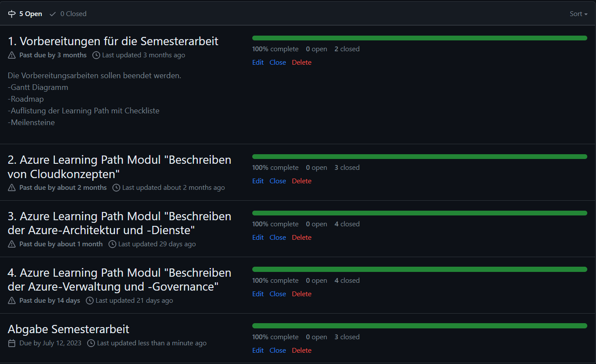
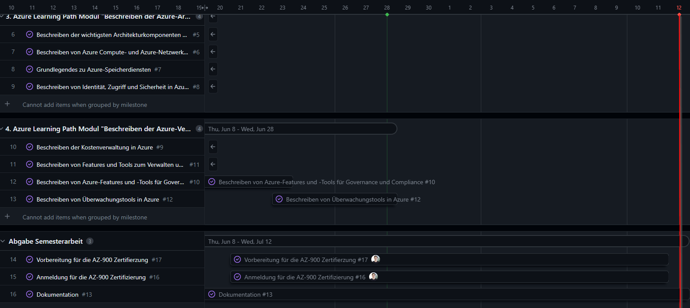

## 3. Sprint Abschluss

Rückblickend auf den Sprintabschluss 3 kann ich sagen, dass ich meine Arbeit pünktlich abgeben kann und alle meine Ziele erreicht habe. Ich konnte mich an meine geplante Termine halten, und habe dadurch einen Zeitvorsprung erhalten. 

So sieht der Stand momentan aus.

Im Gantt-Diagramm sieht es aktuell wie folgt aus. Der rote Strich visualisiert das Ende des 3. Sprints.

### Was ist gut oder schlecht gelaufen?

Im letzten Teil der Semesterarbeit ist mir alles gut gelungen, dadurch dass ich mir fixe Termine für die Arbeiten an der Semesterarbeiten eingeplant habe, bin ich schnell vorwärtsgekommen und habe immer mehr Motivation gefasst, die Arbeit zu beenden. Ich habe alle Learning-Path Module durchgeführt und die AZ-900 Zertifizierung erfolgreich absolviert. Ich bin froh, dass ich mir als Ziel zu Anmeldung der Zertifizierung gesetzt habe, dass ich 90 % in 3 aufeinander folgenden Übungsprüfungen erreichen muss. Somit konnte ich von erforderlichen 700 Punkte, 805 erzielen.

### Abschluss

Hier findet man das [Schlusswort der Semesterarbeit](../3_Abschluss/Schlusswort.md)

## Inhaltsverzeichnis

[5. Sprintabschlüsse](./README.md)

[Titelseite (Hauptinhaltsverzeichnis)](../README.md)